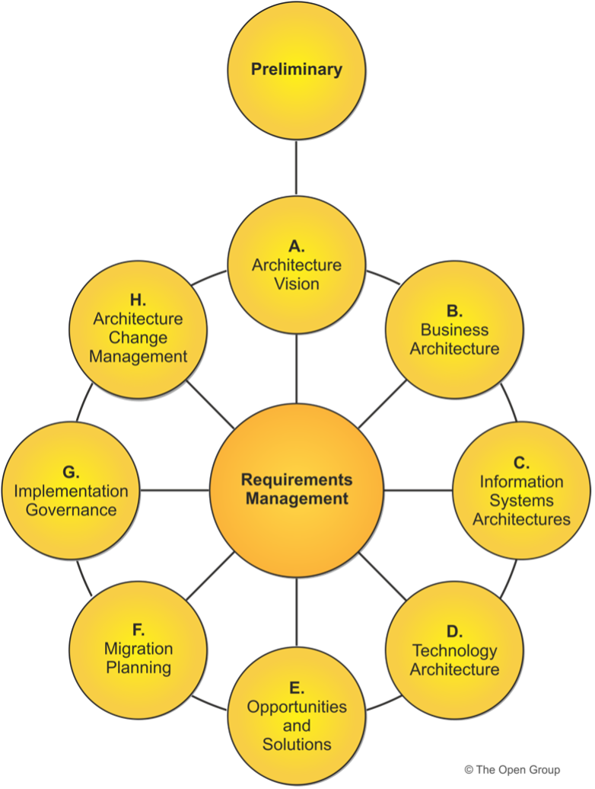
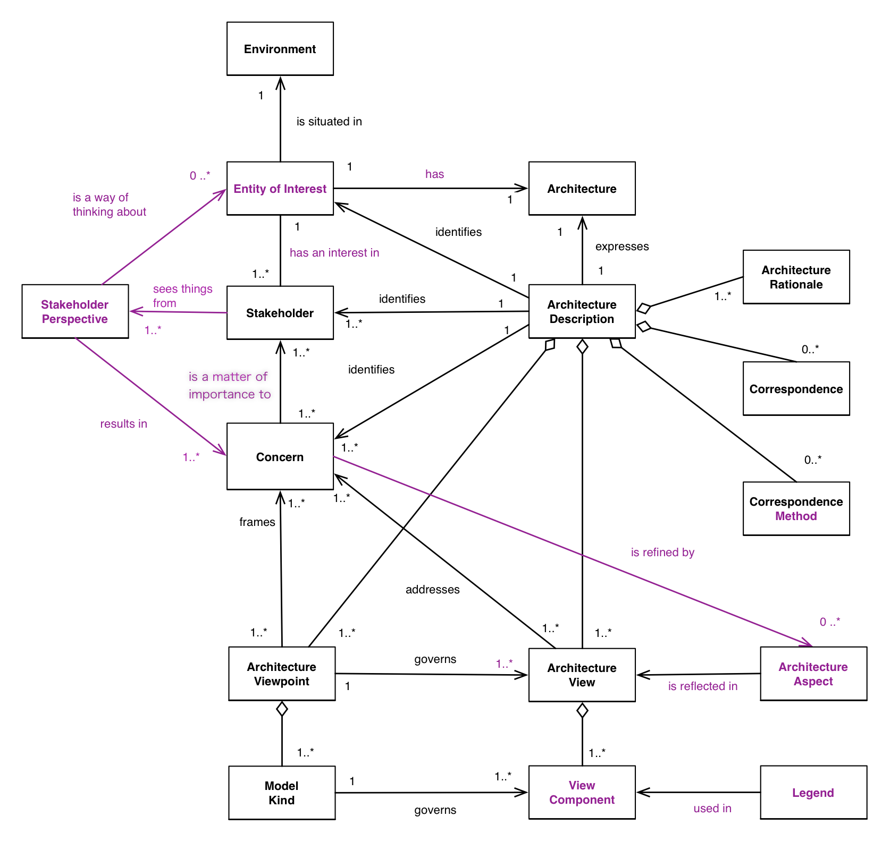
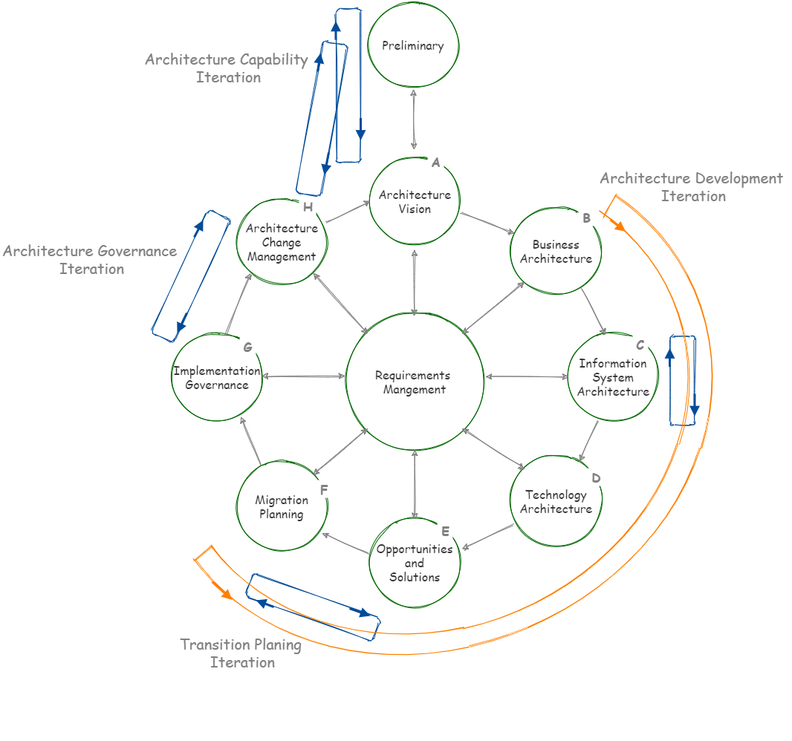
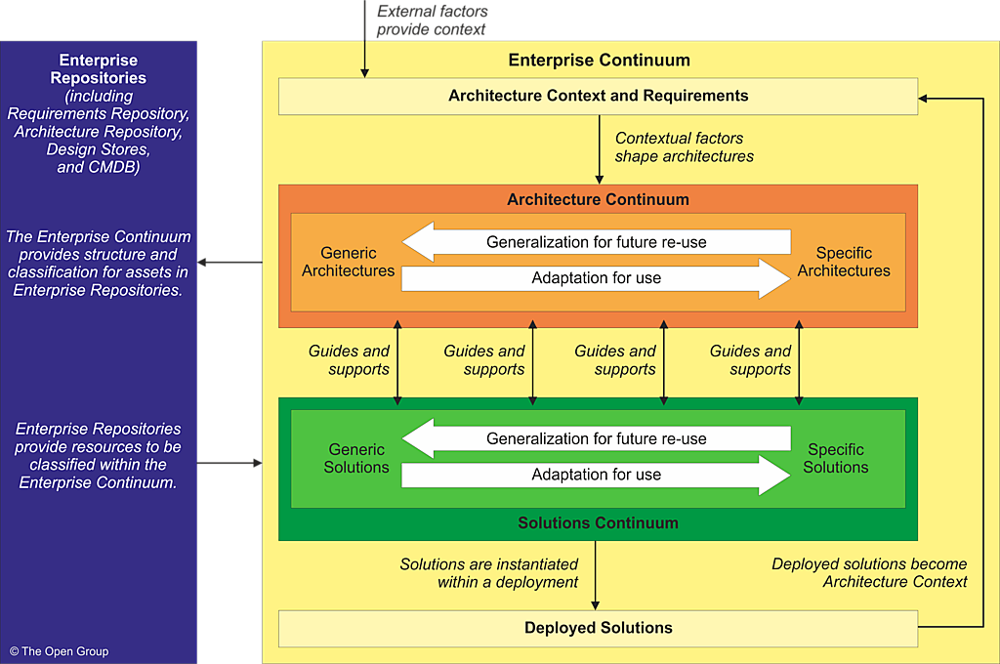
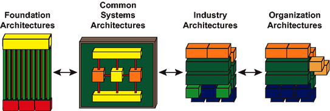

# TOGAF 10

Notes from udemy course "Enterprise Architecture Foundation with the TOGAF Standard" by Palladio Consulting (Dr. Christopher Schulza and Tobias Smuda). Exam: TOGAF Enterprise Architecture Foundation (part 1): 40 basic single choice questions, 60 minutes, Closed book (no access to any materials), Pass mark is 60% (24 correct answers). Can be booked with Pearson Vue. Takes place at a tets center, or remotely with video surveying.

## Introduction To Enterprise Architecture

**Enterprise** may mean the entire enterprise, or an area of the business. May also include multiple business, clients, partners, units, departments, etc. An enterprise may maintain several different architectures, or one.

**Architecture**:
- (IEEE) the fundamental concepts or properties of a system in its environment embodied in its elements, relationships, and in the principles of its design and evolution
- (TOGAF) the structure of components, their inter-relationships, and the principles and guidelines governing their design and evolution over time.

### Architecture Domains

- Business architecture: business strategy, governance, organization, and key processes.
  - Capabilities, processes, value streams, information concepts, organizational structure
  - Artifacts: Business Capability Map, Value Stream Map, Org Map, ...
- Data architecture: conceptual, logical, physical data assets, and data management resources.
  - Data objects, data management resources, data objects
  - Artifacts: Data Dissemination Diagram, Data Entity/Business Function Matrix, Application / Data Matrix, ...
- Application architecture: blueprint for app deployment, interactions, and relationships to the business.
  - apps, interfaces, app domains, app functions, app services
  - App portfolio catalog, Application communication diagram, Application / Organization matrix, ...
- Technology architecture: logical software and hardware infrastructure to support the business, data, and applications.
  - IT infrastructure, networks, middleware, cloud services, runtime environments
  - Technology portfolio catalog, Platform decomposition diagram, Environments & Location diagram, ...

The last 3 are called the "IT architecture". Each architecture can be described/visualized by a set of artifacts (diagrams).

### Architecture States

- Baseline Architecture: current state, reference for future changes
- Target Architecture: future state that has been approved by stakeholders
- Transition Architecture: fully functional state that partially realizes the target. Can have many of these.
- Resting architecture: state where the org receives value if all change activity is suspended.
- Candidate architecture: unapproved target architecture.

Baseline and target are the most important ones. There's always a baseline, not the others.

### Scope Of Architecture

- Enterprise Scope (breadth): what is the extent of the enterprise that is covered by the architecture.
- Level Of Detail (depth): how deep should the architecture go
- Domains: which domains (out of the four) are being covered
- Time Horizon: what time period needs to be covered by the vision.

### Architecture Levels

Divide the enterprise landscape into three levels of granularity:
- Strategic Architecture: provides direction-setting at the Executive level. Covers the full enterprise, with low level of detail, and high scope/breadth.
- Segment Architecture: provides direction at a program/portfolio level. Has a mid level of detail, time, and scope.
- Capability Architecture: effectively supports roadmaps by providing capability increments. High level of detail, small breath (one process), and small time period. 

You can have one strategic architecture, supported by many segment architectures, each supported by many capability architectures.

### Architecture Partitions

A slice of the architecture landscape, with defined boundaries, and a common team and governance. Each team owns one or more partitions.

The partitioning model should reflect the operating model of the enterprise. This allows conflict management, parallelization, re-use, and complexity management/governance.

### Architecture Abstraction Levels

From high-level to more detailed:

- Contextual: why is it needed. Understands the environment.
- Conceptual: what functionality needs to be met. Understands the problem.
- Logical: how should the functionality be structured (implementation-independent)
- Physical: with what assets should it be implemented. Meets the logical components.

Abstraction levels are not to be confused with architecture levels. An architecture level can be described with all four abstraction levels.

### Building Blocks (ABB)

Potentially reusable component of an architecture. Package of functionality that meets a business need. Normally corresponds to a Metamodel (actor, business service, application, data entity, ...).
Can be defined at different levels of detail, and can lead to improvements in integration and interoperability. An org must decide how to use building blocks.

A good building block:
- considers implementation and usage, and evolves with tech and standards
- is re-usable, replaceable, and well specified
- may be assemble from, and help assemble, other building blocks
- may interoperate with other building blocks, based on a published, stable interface
- should have defined boundaries and specs, loosely coupled with their implementation.

There are two types of building blocks:
- Architecture Building Block (ABB): Logical architectural component that describes a capability
- Solution Building Block (SBB): Physical implementation component, that realizes a capability

### The TOGAF Standard

Community-driven (although only supplier orgs who pay can participate), proven, best-practices standard, to implement any kind of architecture in any context.

It describes a standard cycle of change. Used to plan, develop, implement, govern, change and sustain architecture. Supports agile enterprises, digital transformation, etc.

Adds value, standardizes, and de-risks architecture development. Results are consistent, reflect stakeholder needs, and considers current and future business needs.

Framework is generic, and works well with other frameworks (e.g., ITIL for IT service, COBIT for governance, PRINCE for project management). It may also be used standalone.

The standard consists of:
- TOGAF Fundamental Content: 6 docs on core concepts, the ADM, capability, and governance
- TOGAF Series Guides: guidance to support specific needs

All documents are open and free, on the [TOGAF library](https://publications.opengroup.org/togaf-library), requires log in though.

### EA Purpose and Benefits

**Purpose**: Manage complexity and risk, optimize fragmented legacy components, allowing responsiveness to change. Balance between transformation and operation efficiency. Basically, to document and guide effective change (what to do, what to change).

**Benefits**: return on current investment, digital transformation, decision-making, better operations, better procurement, better balance between demands.

## Architecture Development Method (ADM)

> ADM phases [[source]](https://www.opengroup.org/togaf)

Step-by-step approach of 10 phases, arranged in an 8-phase cycle. Each phases is subdivided into steps. Not a waterfall, as there is not a specific sequence to be followed.

- Preliminary Phase: creates the architecture capability, define principles, teams, processes
- A) Architecture Vision: define scope, vision, and stakeholders
- B) Business Architecture: develop business architecture (baseline and target)
- C) Information Systems Architectures: develop data and application architectures (baseline and target)
- D) Technology Architecture: develop technology architecture (baseline and target)
- E) Opportunities and Solutions: initial implementation planning
- F) Migration Planning: how to move from baseline to target, final migration plan
- G) Implementation Governance: oversight of architecture implementation
- H) Architecture Change Management: procedures for managing change to the new architecture
- Requirements Management: continuous process to manage changes to requirements

Each phase generates outputs (artifacts), and have defined statuses. Outputs are not final, and may be updated.

A first ADM draft is created on phase A, then finalized on phase F.

### Artifacts And Deliverables

There are three types of artifacts: Catalogs (lists), Diagrams, or Matrices (relationships).

Deliverables represent the output of projects. A work product, contractually specified, and formally reviewed and approved. Usually a document (archive of the completion of a project), and stored in an Architecture Repository. Deliverables contain several artifacts. 

A deliverable can either be a Draft, or Approved. Approved doesn't mean finalized, as it may still be updated.

### Key Concepts

TOGAF-10 adopts the [ISO 42010 Conceptual Model](http://www.iso-architecture.org/ieee-1471/cm/) standard for its concepts:

> ISO 42010 CM diagram with core concepts [[source]](http://www.iso-architecture.org/ieee-1471/cm/)

Conceptual Model:
- Stakeholder: individual, team or org with an interest in the system
- Concern: interest in the system relevant to a stakeholder. Leads ot requirements
- Architecture Viewpoint: perspective from which a system can be viewed. Sometimes called definition or schema. It is generic and reusable, and catalogued under a viewpoint library.
- Architecture View: representation of a system, from the perspective of a viewpoint, to address concerns. Communicates the architecture to stakeholders.

## Preliminary Phase

**Purposes & Objectives**: create an Architecture Capability, and define Architecture Principles.

*Note: Architecture Capability is like a meta-concept, it's the enterprise's ability to execute architecture work. In details processes, roles, and structures that support architecture work. It may include a Board of Architects, a compliance framework, architecture contracts, governance, maturity, skills, etc.*

Steps:
1. Scope the organizations impacted
2. Confirm governance and support frameworks
3. Define and establish the EA team and organization
4. Identify and establish the Architecture Principles
5. Tailor the TOGAF framework
6. Develop a strategy and implementation plan for tools and techniques

*You don't need to know the steps to pass the Part 1 certification. Only for Part 2*

### Architecture Principles

Guide an architecture process. May differentiate between Business, Data, Application, and Technology principles. Intended to be enduring and rarely changed. Require consensus. Typically developed by the architects, approved by a board. Principles are future-oriented, and should be very few.

Principles are catalogued on a Principle Repository, and can be organized in a hierarchy. There are enterprise principles (least granular), segment principles, and architecture principles (most granular). There are two types of principles:
- **Enterprise Principle**: cross-org principles to inform decision-making.
- **Architecture Principle**: relate to architecture work, and govern its processes.

There is a standard way to document principles, with 4 fields: **Name** (simple essence), **Statement** (unambiguous rule), **Rationale** (benefits of adhering), **Implications** (requirements in terms of resources, costs, activities). Example:

| Name                | Statement                                                             | Rationale                      | Implications                                                                                                                  |
| ------------------- | --------------------------------------------------------------------- | ------------------------------ | ----------------------------------------------------------------------------------------------------------------------------- |
| Compliance With Law | Enterprise information processes comply with all relevant regulations | Policy is to abide by the law. | Comply with data retention regulations; provide education and access to rules; adapt business according to changes in the law |

Good principles are:
- Complete: well defined in any situation
- Consistent: no contradictions
- Stable: enduring, yet able to adapt
- Understandable: intentions are clear, violations are minimal
- Robust: enables good and consistent decisions

Good principles: enable decision making, align the enterprise, support governance, reflect value and culture.

### General Approach

1. Define the enterprise (higher level of description)
2. Identify key drivers and organizational context
3. Define the requirements for architecture work
4. Define the Architecture Principles
5. Define the framework to be used
6. Define the relationship between all management frameworks
7. Evaluate the enterprise maturity (*there is a small guide on the Library [TOGAF® Series Guide: Architecture Maturity Models](https://publications.opengroup.org/g203)*)
8. Determine the Architecture Capability desired by the organization

## Architecture Vision Phase A

**Purposes & Objectives**: defines scope, stakeholders, concerns, develops a high-level aspirational **Architecture Vision**, and obtain approval for a Statement of Architecture Work (which contains the vision).

Steps:
1. Establish the architecture project
2. Identify stakeholders, concerns, and business requirements
3. Confirm and elaborate business goals, drivers, and constraints
4. Evaluate capabilities
5. Assess readiness for business transformation (*see [TOGAF® Series Guide: Digital Technology Adoption: A Guide to Readiness Assessment and Roadmap Development
](https://publications.opengroup.org/g212)*)
6. Define scope
7. Confirm and elaborate Architecture Principles
8. Develop Architecture Vision
9. Define Target Architecture value proposition and KPIs
10. Identify transformation risks and mitigation activities
11. Develop Statement of Architecture Work, secure approval

*(reminder that steps are not part of the Part 1 Exam.)*

Next we are going to look at each deliverable of this phase.

### Request For Architecture Work

Architecture Vision work starts from a Request For Architecture Work, generated in the preliminary phase. It's a high-level, 5-chapter document that lists:

- Organization sponsors, mission statement, budget, constraints
- Business goals, strategy, changes in environment, constraints
- Business systems, IT systems, and architecture description
- Developing organization including resources

There is a template online for it. The ADR phases A-G use this as input.

### Communications Plan

Allows communication of the architecture within a managed process. It's a document detailing stakeholders or groups, information (e.g., vision, risks, success factors), mechanisms (channel), and timetable (i.e., who receives what, when).

There is a free template for this too. It's used as input for phases B-F.

### Business Scenario Technique

Technique to identify, document, and approve business requirements. Derive the characteristics of the architecture from the high-level business requirements. Can be applied to very general or very specific business problems. There is a template for this too. They contain the following key elements:
- Business problem
- Business and Technology environment
- Desired outcomes
- Human actors
- Computer actors

Good business scenarios are SMART: Specific, Measurable, Actionable, Realistic, Time-bound. Business scenarios are like a snapshot of the business today, and should be updated as the business changes. Business scenarios are captured in phases: Plan > Gather Information > Analyze > Document > Review.

This is related, but different, from other techniques like Use-Cases (OMG), Business Models, SPIN (Situation, Problem, Implication, Need-payoff), Engineering Specs (IEEE).

### Architecture Requirements Specification

A deliverable created in phase A, Architecture Vision. It defines:
- Architecture, Interoperability, IT Service Management requirements
- Business and Application service contracts
- Implementation guidelines, specifications, standards
- Success measures, constraints, assumptions

There is a free template for this too in the TOGAF library. This deliverable is further drafted in the following ADR phases. It is finalized in the phase F (migration planning).

### Business Principles, Goals, and Drivers

These vary considerably across enterprises. There is a template for this too, it's just a systemized way to capture the three elements: principles, goals, and drivers.  These are used and validated in steps B-D.

### Capability Assessment

A capability can be assessed on different levels: Business Capability Assessment, IT Capability Assessment, Architecture Maturity Assessment, and Business Transformation Readiness Assessment. There is a template in the library for this too. These are used as input for phases B-G to understand readiness and gaps.

#### Business Transformation Readiness Assessment

The approach for this is to undertake five activities:
1. Determine the readiness factors to be assessed
2. Present the readiness using maturity models
3. Assess (rate) the readiness factors
4. Assess the risk for each readiness rating, and determine mitigation actions
5. Work these actions on phases E-F

There are several maturity templates available (ex: maturity model for data architecture).

### Architecture Vision

Value to be delivered by the project. Contains a problem description, an objective of the Statement of Architecture Work, Summary views, and mapped requirements and reference to draft the Architecture Definition Document. There is a template for this too in the Library. The vision document is used in phases B-D. It can later be updated.

### Architecture Definition Document

Qualitative view of the solution, communicates the intent of the project (whereas the requirements specification is quantitative). It contains:
- Scope, Goals, Objectives and Constraints, Architecture Principles, Baseline & Target Architectures, Gap Analysis, Impact Assessment
- Architecture Models for all domains
- Rationale and justification
- Mapping to Architecture Repository
- Transition architectures

There is a template for this document. Artifacts in this document describe building blocks. Only a draft is created on phase A, and then throughout phases B-D it is updated and reviewed. It is finalized in phase F., and then used/updated.

### Statement of Architecture Work

Last step of phase A. It serves as a contract between the architecture team and the stakeholders/sponsors. It contains:
- Title, approvals, change of scope procedures
- Project request, background, description, scope, plan, and schedule
- Acceptance criteria, procedures, roles, responsibilities, and deliverables
- Overview of Architecture Vision

There is a free 9-chapter template for this too. This is used on all phases, and updated as needed.

### General Approach

- Receive request for architecture work.
- Define what's in and out the scope of the effort
- Understand the business and architecture principles, goals, and drivers
- Describe (high level) baseline and target architectures for all domains
- Create the Statement of Architecture Work (including an overview of the Architecture Vision)
- Use Architecture Vision to communicate and get sponsorship for the work

## Business Architecture Phase B

The business architecture supports the architecture vision. It shows how the business fails to meet the stakeholder's needs. It also identifies which changes are required to meet those needs. Finally, it defines Work Packages to achieve the necessary changes. Work Packages must always make sense in a cost-benefit analysis. The next phases B-D have analogous purposes.

There are two objectives: develop a Target Business Architecture, and identify candidate Architecture Roadmap components based on the gaps between current and target states.

### Steps

1. Select reference models, viewpoints, and tools
2. Develop Baseline Business Architecture
3. Develop Target Business Architecture
4. Perform gap analysis
5. Define candidate roadmap components
6. Resolve impacts across the entire architecture Landscape
7. Conduct formal stakeholder review
8. Finalize the Business Architecture
9. Update Architecture Definition Document

*(not needed for Part 1 Exam)*

### Gap Analysis

Gaps define what must be changed in the enterprise. They can be found on all four architecture domains. To understand gaps, you create a Gap Analysis Matrix (rows are baseline architecture ABBs, cols are Target architecture ABBs). Add a new row "New" and a new column "Eliminated". Fill the cells accordingly.

The Gap analysis is relevant for phases B-D, in other words, for all four domains. In these phases we define candidate components that address the gaps. Then in phase E we review and consolidate the gap analysis.

### General Approach

- Research, verify, and gain buy-in to key business objectives
- Use and update documents from phase A
- Determine if the fundamental view of the business is changing
- Develop business architecture models:
  - Business Capability Map
  - Value Stream Model
  - Organization Map
  - Business Process Model
- Use resources from the Architecture Repository

## Information Systems Architecture Phase C

**Purposes & Objectives**: divided in two parts: the Application Architecture and the Data Architecture. The purpose is, like before, to define the baseline and target architectures, identify the gaps, and candidate components.

Steps are the same as for phase B.

### Application Architecture Artifacts

There are many artifacts (catalogs, diagrams, matrices) that TOGAF recommends for application architecture. Here are a few ones:

- Application Portfolio Catalog: list of all applications, with key attributes (e.g., name, description, category, source)
- Application Communication Diagram: shows interactions between applications, and the protocols used
- Application / Organization Matrix: shows which applications are used by which organizational units

### Data Architecture Artifacts

Just like before, there are many artifacts that TOGAF recommends for data architecture. Here are a few ones:

- Data / Entity Function Matrix: shows which data entities are owned by which business functions
- Logical Data Diagram: shows relationships between critical data entities

### General Approach

- For the application architecture, the TOGAF standard is very vague, and suggest using generic business models from the industry sector
- For the data architecture, there are three considerations:
  - Data Management
  - Data Migration
  - Data Governance
- There are three meta-models to be used for the data architecture (data at rest, in motion, in use, open data, ...):
  - Data Entity: conceptual model
  - Logical Data Entity: data model schemas
  - Physical Data Entity: implemented data models

## Technology Architecture Phase D

To develop baseline and target technology architectures, identify gaps, and candidate components. Steps are the same as for phase B.

### Technology Architecture Artifacts

- Technology Portfolio Catalog: list of all technology components (e.g., name, description, date, category). Usually the first step
- Platform Decomposition Diagram: depicts the technology used in each platform. May include specs
- Environments & Location Diagram: what technologies are used at which locations (site).

There are many more artifacts available.

## Opportunities And Solutions Phase E

At this point target architectures are solution-independent. Now it's time to find the solutions that implement the building blocks.

### Purpose And Objectives

The purpose is to find Solution Building Blocks (SBB) that implement the Architecture Building Blocks (ABB) defined in phases B-D. This also means identifying dependencies and vehicles (projects, programs, portfolios). Each Work Package is evaluated by its value, effort and risk and then prioritized. The output is: Work packages, Addressed gaps, Added value, Required effort, and Dependencies.

The objectives are:
1. Generate complete Architecture Roadmap
2. Determine whether an incremental approach is possible, and its Transition Architectures
3. Define the SBBs and finalize the Target Architecture

### Steps

1. Determine or confirm key corporate change attributes
2. Determine the business constraints implementation
3. Review and consolidate the gap analysis
4. Review the consolidated requirements
5. Reconcile the interoperability requirements
6. Validate the dependencies
7. Confirm readiness and risk for transformation
8. Formulate Implementation and Migration Strategy
9. Identify and group Work Packages
10. Identify Transition Architectures
11. Create Architecture Roadmap And Implementation And Migration Plan

This phase is the bridge between the target architecture and the solution.

### Interoperability Requirements

Interoperability is the ability of two or more systems to exchange information and use it. TOGAF recommends the Enterprise Application Integration (EAI) standard to discuss interoperability:
- Presentation Layer: user interfaces, APIs
- Information Layer: security, access, structure, quality
- Application Layer: infrastructure applications
- Technical Layer: services, data storage, data processing, infrastructure

### Risk Management

Risk is the effect of uncertainty on objectives (ISO 31000:2009). Risk triggers can come from inside or outside the enterprise. Risk Management is identifying and addressing the risks. 

Risks can have an initial level (prior to mitigation) and a residual level (post mitigation). They can be differentiated between Business Risks and Cyber Risks (IT). Risk assessment is a top-down process:
- Risk identification
- Risk classification
- Initial risk assessment
- Risk mitigation
- Residual risk assessment
- Risk monitoring and governance

Risk effects can be catastrophic, critical, marginal, or negligible. Risk frequency can be frequent, likely, occasional, seldom, or unlikely. Placing risks along these two axis allows us to label them as High, Extremely High, Moderate, or Low. See an example Risk Classification Scheme matrix below:

| -            | Frequent | Likely | Occasional | Seldom | Unlikely |
| ------------ | -------- | ------ | ---------- | ------ | -------- |
| Catastrophic | E        | E      | H          | H      | M        |
| Critical     | E        | H      | H          | M      | L        |
| Marginal     | H        | M      | M          | L      | L        |
| Negligible   | M        | L      | L          | L      | L        |

Risks are validated on phase F, monitored on phase G, and managed on phase H.

### Architecture Roadmap

Lists all Work Packages and their business value when realizing the target architecture.

A Work Package includes: Description, Functional Requirements, Dependencies, Value, Relationship to the Architecture Definition Document.

The roadmap also includes the Implementation Factor Catalog, listing risks, issues, assumptions, dependencies, actions, and inputs.

The roadmap consolidates tje gap analysis, and the Solutions And Dependencies Matrix. It may include Transition Architectures, and implementation recommendations.

There is a template in the library. The roadmap is finalized in phase F, and used in phase G.

### Implementation And Migration Plan

Aligned with the roadmap, this plan includes a schedule, executable projects, and a strategy. It demonstrates the *how*.

There is a template for it too in the library. It's also finalized in phase F, and used in phases G and H.

### General Approach

- Figure out the Work Packages
- Figure out the Transition Architectures
- Create the Architecture Roadmap
- Create the Implementation and Migration Plan

## Migration Planning Phase F

### Purpose And Objectives

The purpose answers how to move from baseline to target. It finalizes the Implementation And Migration plan, and it estimates the resources required to undertake the change (while ensuring availability). Stakeholder priorities are adjusted if needed. The main output is an approved set of projects (Work Packages). A project includes objectives, constraints, required resources, and a schedule. 

A key objective here, besides finalizing the plan, is to ensure stakeholders understand the value/cost of work packages.

### Steps

1. Confirm management framework interactions
2. Assign business value to each Work Package
3. Estimate resource requirements, timings, and delivery vehicles
4. Prioritize migration projects through a cost/benefit analysis
5. Confirm the Architecture Roadmap and update the Architecture Definition Document
6. Complete the Implementation and Migration Plan
7. Complete the architecture development cycle, and document lessons learned

### Implementation Governance Model

This is where we transition from developing, to realizing the enterprise architecture. To do this, we create an Implementation Governance Model. It contains the governance process, the governance organization structure (body) along with their roles and responsibilities, and finally governance checkpoints with success or failure criteria.

There is a template for this in the library. This document is created in phase F, and applied in phase G.

### General Approach

- Finalize the Implementation and Migration Plan
  - Include project-level details
- Integrate the Architecture Roadmap and the Implementation and Migration Plan with the business's change activities
- Assess the dependencies, costs, and benefits of the Work Packages
- Transition to Implementation Governance and document lessons learned (via a workshop)

## Implementation Governance Phase G

### Purpose And Objectives

Ensure compliance of the implementation. Guide the implementation teams. Manage stakeholder priorities and preferences. The main outputs are the completed projects, and the adjusted target state.

The goal is simply to ensure the implementation complies with the design. If there are implementation-driven changes, those Change Requests need to go through the governance process too.

### Steps

1. Confirm scope and priories with the development team
2. Identify deployment resources and skills
3. Guide development of solutions
4. Perform compliance reviews
5. Implement business and IT operations
6. Perform post-implementation reviews and close the implementation

### Architecture Contracts

#### Development Contracts

A way to ensure an implementation conforms to the architecture. It's a joint agreement between architects, sponsors, and developers, on the deliverables, quality, and fit-for-purpose of an architecture. Contracts ensure accountability, responsibility, and discipline.

These contracts are also used in phase H for change management. They are available in the TOGAF library.

The content of these contracts often vary, usually they are divided into two types:
- development contract: includes intro and background, scope, requirements, development process and roles, target measures, deliverable phases, prioritized work plan, time windows, delivery and business metrics.
- business contract: intro and background, scope, requirements, adopters, time window, business metrics, and the Service architecture including Service Level Agreement (SLA).

#### Statement Of Architecture Work

Created in phase A. Defines the scope and approach of the architecture work. It contains title, approvals, change of scope procedures, project request, background, description, scope, plan, schedule, acceptance criteria, procedures, roles, responsibilities, and deliverables. It also contains an overview of the Architecture Vision.

#### Architecture Design And Development Contract

Statement of intent on designing and implementing some parts of the Enterprise Architecture. Usually signed with application providers or system integrators.

#### Business Stakeholder's Architecture Contract (aka Business Users Architecture Contract)

Signed between the architecture team and the business stakeholders who will build the solutions.

#### Contracts Summary

- Phase A: Statement Of Architecture Work
- Phases B-D: Contracts with app providers, system integrators, system providers
- Phase F: Contract between business stakeholders (the ones who will implement) and the architecture team
- Phase G: Contracts between architecture team and development teams (in-house or contractors)

### Compliance Assessment

A process to ensure development is in line with the vision. It also ensures implementation learnings are fed back into the architecture process.  It contains an overview of progress, status, and design. It also includes a checklist of methods and tools.

There are two types of compliance assessments:
- Target Architecture Checklist: it checks the development of the architecture itself. Example questions from the checklist verify if the stakeholders were correct, if the guidance from the superior architecture was taken into account, if the appropriate SMEs agree, etc. Stakeholders must approve this review, otherwise it needs to be reworked or cancelled.
- Implementation And Other Changes Checklist: checks the implementation, at specific checkpoints of the project. It's a chance to correct any major errors or shortcomings. It asks things like: was the architecture guidance reasonably interpreted, did the SMEs agree with the impact assessment, do they agree with the recommendation, targets, deadlines, etc. The Architect acts as an auditor and architect, and makes recommendations to enforce compliance, provide relief, or even change the Target Architecture. 

Checklist is available on the Series guide: *A practitioners approach to developing enterprise architecture following the TOGAF ADM*.

### General Approach

- Perform incremental steps towards the Target Architecture, where each step delivers value
- Establish implementation program
- Adopt a phased deployment schedule
- Develop project details (e.g., name, description, acceptance criteria, measures of effectiveness)

## Architecture Change Management Phase H

### Purpose And Objectives

Ensure the architecture achieves its target and value. Identify gaps in the architecture. Manage necessary changes (prioritize, define requirements). Also, the goal is to update the Target Architecture to address shortfalls.

> As one objective, the ADM Phase H ensures that the Enterprise Architecture Capability meets current requirements.

### Steps

1. Establish value realization process (make sure the communicated value is obtained, like shutting down old services)
2. Deploy monitoring tools
3. Manage risks (out-of-date software versions, address security vulnerabilities, etc.)
4. Conduct Enterprise Architecture performance review (is it performing according to requirements)
5. Develop change requirements if needed
6. Manage governance process (ensure processes are executed, for example prioritizing change requests)
7. Activate process to implement change (kick off a new ADM cycle)

### The Change Request

Change requests can stem from:
- Technology: new technology available, cost reduction, end of life, standard initiatives
- Business: business development, business exceptions, innovation, strategy changes

It's a deviation from the previously defined approach, based on knowledge gained or external factors. Change requests contain descriptions and rationale, an impact assessment, and a reference number. There is a template for this in the library. Change requests can be identifier and created on phases E-G, but they are only assessed on phase H.

### General Approach

- Establish criteria to evaluate Change Requests
- Classify Change Requests as: 
  - Simplification: handled by change management techniques
  - Incremental: may require partial re-architecture
  - Re-Architecture: new ADM cycle

## Requirements Management

### Purpose And Objectives

Documents, evaluates, and distributes architecture requirements. It's connected with every other phase, except Preliminary. It drives the ADM, and helps manage requirement changes, by providing clear traceability and visibility (single point of truth).

It's a dynamic process to ensure the requirements process is operational, and that they are available for use as phases get executed.

### Steps

1. (A) Identify requirements, and document them in the Architecture Requirements Specification (within scope) and Requirements Repository (outside scope)
2. Establish baseline requirements aligned with priorities
3. Monitor baseline requirements
4. (B-D) Identify new and changed requirements, reassess their priority
5. Solve conflicting requirements and Generate Requirements Impact Statement
6. (E-G) Assess impact of changed requirements. Decide whether to implement changes.
7. (H) Implement necessary updated requirements
8. Update the Requirements Repository
9. (H) Implement changes via implementation projects
10. Conduct gap analysis, identifying new (gap) requirements, recording them in the Requirements Repository, and revising the target architecture if needed

Remember that minor maintenance change can be implemented directly (still need to be aligned with architects).

### Requirements Impact Assessment

Performed in the ADM phases when a change is identified. New information is gathered, and this document will describe the phases to be revisited, the investigation results, recommendations, and references to requirements with their reference numbers.

### General Approach

- identify and store requirements 
- feed in and out of ADM phases
- record architecture requirements on the Architecture Requirements Repository

## Applying ADM

ADM is an iterative process, over, between, and within phases.

> Image: example of how parts of ADM can cycle. [source](http://blogs.malekmakan.com/post/togaf-architecture-development-method).

There are 5 cycles:
- Iteration through the ADM (phases A-H)
- Architecture development iteration (phases B-D)
- Architecture capability iteration (in and out of Preliminary stage, from phases A or H)
- Architecture governance iteration (phases G-H)
- Transition planning iteration (phases E-F)

This also means an architecture project does not need every single phase, and that certain phases can be repeated, or executed simultaneously. Phases may stay open to produce the needed information. The TOGAF phase diagram represents information flow, not a sequence of execution.

### Building Block Specification Process

Applying the architecture development method means creating and maintaining Building Blocks. Architecture Building Blocks (ABB) meet business goals, and selected ABB's become Solution Building Blocks (SBB) which are either purchased or developed in-house.

### The Trade-Off Method: alternative architectures and trade-offs

The job of the architect is to identify all alternative target architectures, understand them, identify the trade-offs, and present this back to stakeholders. There is a TOGAF method to do this, called the *Architecture Trade-Off Method*. It's just a structured way to choose an alternative based on governing principles and requirements.

### Digital Enterprise

A digital enterprise is an enterprise that either (1) creates products or services delivered fully digitally, or (2) delivers physical products or services ordered digitally.

TOGAF supports agile environments by helping teams deliver quicker and better through:
- Managing technical debt reactively and proactively
- identifying standards and reusable components
- providing governance to oversee the reuse of components
- simplifying complexity
- establishing an enterprise capability that drives operational excellence
- institutionalizing agile development methods

## Content Framework & Core Concepts

### Content Framework

This is just a standardized way to organize the outputs of the ADM. There are many frameworks to choose from (TOGAF Content Framework, Zachman Framework, DoDAF, NAF, etc.). Depends on the architects, and the EA tool being used. 

It just defines which artifacts are required to describe the architecture project. It provides consistency, a checklist of outputs, reduces risks of gaps, and defines standards.

See this [blog post](https://www.visual-paradigm.com/guide/togaf/togaf-adm-and-architecture-content-framework/) for an example.

### Enterprise Meta-model

It defines the entities that are involved in architecture work, so that architects can use a common language when describing things. It improves consistency. It's enterprise-specific, meaning that each company will need/have a different (high quality) meta-model.

It can be developed based on stakeholder viewpoints, or based on an established meta-model. Here is [a basic example of a meta-model from Linkedin](https://www.linkedin.com/pulse/simple-enterprise-metamodel-arron-rouse/).

### Architecture Repository

Place where ADM artifacts are stored, and it should contain a formal taxonomy of the outputs so they can be used. Usually this is a document management system or file repository. The difference between this and the Content Framework, is that the Repository is the *actual* place where artifacts are stored, meanwhile the Content Framework is a *guide* on what should stored and how its organized.

See [this post](https://guides.visual-paradigm.com/what-is-architecture-repository-in-togaf/) for an example.

### Enterprise Continuum

Categorization for assets held in an Architecture Repository. It contains two concepts: the Architecture Continuum (for architectures), and the Solutions Continuum (for solutions). Each is a spectrum between generic and specific assets: generic documents should be adapted for use, and specific documents should be generalized for re-use.

It's just a way to create a view that labels artifacts as generic or specific. See [this post](https://guides.visual-paradigm.com/what-is-enterprise-continuum/) for more info.

> Enterprise Continuum

> Architecture Continuum

## Architecture Governance And Capability

### Architecture Governance

Governance is a system to control the direction of the enterprise. It is committed to hierarchical decision-making within a structure of roles, to help the enterprise achieve its goals. It accounts for the equality of concerns, transparency, and protects the rights and interests of the business. It drives behaviors via measurements and metrics.

Governance enacts a board to review and guide corporate strategy. Commonly the supervisory board, or executive board. Ensures strategic guidance, management monitoring, and accountability. 

An architecture board publishes architecture contracts,  ensures their implementation, resolves ambiguities, ensures compliance, considers policy changes, validates reports. They don't make decisions about Target Architectures (the stakeholders do), but they assess process, recommendations, confidence and completeness.

There are several levels of governance: Corporate Governance > EA Governance > Business Architecture Governance > Domain Architecture Governance > Implementation Governance.

TOGAF adopts the governance model from Ramani Naidoo's book *Corporate Governance*. The benefits are discipline, responsibility, accountability, fairness, transparency, and independence.

### Architecture Capability

Basically a department in your company for architecture. Consists of roles, org structure, and normal business management capabilities (financial, performance, service, communications, ...). It provides a skilled architect pool, to be used in architecture projects.

The purpose capabilities are:
- Architecture to support strategy (high level, broad scope, 3-10 year targets)
- Architecture to support portfolio (high level, single subject scope, 2-5 year targets)
- Architecture to support projects (low level, single project scope, < 2 year targets)
- Architecture to support solution delivery (very detailed, single project scope, < 2 years)

*(this topic is likely to be asked in the exam*)

Funnily enough, you can use the ADM framework to develop an Enterprise Architecture Capability.

## Exam Preparation

Study the ADM phases, techniques, and deliverables. Complete example questions. Test under real conditions. You must answer 40 questions in 60 minutes.

### Glossary (Most Important Definitions)

#### A

- **Application Architecture**: describes the structure and interaction of the application systems in an enterprise.
- **Architecture**: fundamental concepts or properties of a system in its environment embodied in its elements, relationships and the principles of its design and evolution. The structure of components, their inter-relationships, and the principles and guidelines governing their design and evolution over time. 
- **Architecture Building Block (ABB)**: architectural component that specifies SBBs at a logical (supplier-independent) level
- **Architecture Capability**: part of the Architecture Repository that includes parameters, structures and processes that support its governance
- **Architecture Compliance**: The Enterprise and IT Governance functions will define a formal Architecture Compliance review process for reviewing the compliance of all projects to the Enterprise Architecture.
- **Architecture Continuum**: a categorization mechanism, with increasing detail and specialization, for the components and artifacts stored in the Architecture Landscape or Reference Library (part of the Architecture Repository)
- **Architecture Development Method (ADM)**: multi-phase iterative process for developing an enterprise architecture to shape and govern business transformation.
- **Architecture Domain**: architectural area being considered. there are four primary domains: Business, Data, Application, and Technology.
- **Architecture Framework**: a conceptual structure to plan, develop, implement, govern, and sustain an architecture.
- **Architecture Governance**: In consequence, Architecture Governance is a system by which (Enterprise) Architectures are directed and controlled. The practice of monitoring and directing architecture-level work. The goal is to deliver desired outcomes while adhering to principles, standards, and roadmaps.
- **Architecture Landscape**: the set of all architectural assets within an enterprise at particular points in time.
- **Architecture Level**: levels provide a way of dividing the landscape into more granular definitions. Not to be confused with Architecture Partitions.
- **Architecture Model**: a representation of a subject of interest. Provides a smaller scale, simplified/abstract representation of the subject.
- **Architecture Partition**: a subset of the architecture, divided to facilitate its development.
- **Architecture Principle**: a qualitative statement intent that should be met by the architecture. Architectural Principles are detailed requirements that must be fulfilled by every implementation project.
- **Architecture View** a representation of a system from the perspective of a related set of concerns.
- **Architecture Viewpoint**: a specification of the conventions for a particular kind of architecture view. An architecture viewpoint can also be seen the schema of an architecture view.
- **Architecture Vision**: a short description of the target architecture that shows its business value.
- **Artifact**: a work product that describes an aspect of the architecture. It can be a catalog, diagram, matrix, or document.

#### B-C

- **Baseline**: a spec that has been formally reviewed and agreed upon, that serves as a basis for further development. It can only be changed through formal change control procedures.
- **Building Block**: a potentially reusable component that can be combined with other BBs to deliver architectures and solutions.
- **Business Architecture**: a representation of holistic, multi-dimensional business views of capabilities, end-to-end value delivery, information, and organizational structure.
- **Business Capability**: a particular ability or capacity that a business may possess or exchange to achieve a specific purpose or outcome.
- **Business Model**: describes the rationale for how an organization creates, delivers, and captures value.
- **Capability**: an ability that an organization, person, or system possesses.
- **Capability Architecture**: an architecture that describes the abilities that an enterprise possesses.
- **Concern**: an interest in a system relevant to one or more stakeholders.
- **Communications/Stakeholder Management**: the management of needs of stakeholders and the execution of communication between practice and stakeholders.

#### D-I

- **Data Architecture**: describes the structure of an enterprise's major types and sources of data, logical and physical data assets, data management resources.
- **Deliverable**: an architectural work product that is contractually specified and formally reviewed, agreed, and signed off by the stakeholders.
- **Digital Architecture**: focuses on a combination of Enterprise Architecture, data science, telecommunications and internet of things (IoT), security, AI, cognitive science, neuroscience, robotics, and social media to deliver operational services.
- **Enterprise**: the highest level of description of an organization, including its mission, vision, strategy, and goals. It may span a collection of organizations.
- **Enterprise Continuum**: The Enterprise Continuum is a categorization for assets held in the Enterprise Repositories that provides methods for classifying assets, including architecture and solution artifacts as they evolve from generic Foundation Architectures to Organization-Specific Architectures.
- **Gap**: a statement of difference between two states.
- **Governance**: the discipline of monitoring and guiding the management of a business to deliver the required outcomes.
- **Integrated Information Infrastructure Reference Model (III-RM)**: model that focuses on the application-level components and services necessary to provide an integrated information infrastructure.
- **Interoperability**: the ability of two or more systems to exchange information and use it. The ability of systems to provide and received services from other systems.

#### L-S

- **Logical**: implementation-independent.
- **Metamodel**: a model that describes the entities of the enterprise, their characteristics and relationships.
- **Modeling**: technique to construct models which enables a subject to be represented in a form that enables reasoning, insight, and clarity.
- **Physical**: real-world implementation, tangible.
- **Product Lifecycle Diagram**: a key consideration in defining the business strategy and operations, making it most relevant in "Phase B: Business Architecture" of the ADM
- **Request for Architecture Work**: contains the business goals (and changes), strategic plans of the business and changes in the business environment.
- **Requirement**: a statement of need which is unambiguous, testable, and necessary for the architecture to be accepted.
- **Residual Risk**: level of risk after mitigation was applied
- **Roadmap**: an abstract business plan, typically over multiple years.
- **Role**: expected behavior of an actor, or the part somebody/something plays in a particular process or event.
- **Segment Architecture**: a formal description of areas within an enterprise.
- **Solution Architecture**: a description of a discrete and focused business operation or activity, and how IS/IT supports it.
- **Solution Building Block (SBB)**: physical component that realizes part or all of one or more logical ABBs. There are business, application, and technology SBBs.
- **Solution Continuum**: a categorization mechanism, with increasing detail and specialization, for the components and artifacts stored in the Solution Landscape or Reference Library (part of the Architecture Repository)
- **Stakeholder**: a person, team, or organization with interests in the system.
- **Standards Library**: collection that can be used to define particular services and components of an org-specific architecture.
- **Strategic Architecture**: formal description of the enterprise, providing a framework for operational/change activity, at an executive-level, long-term view.

#### T-Z

- **Target Architecture**: a description of the future state of the enterprise. There may be several future states. 
- **Technology Architecture**: describes the structure and interaction of technology services and components.
- **Transition Architecture**: describes an intermediate state of the enterprise that is used to bridge the gap between the baseline and target architectures.
- **Value Stream**: representation of an end-to-end collection of activities that create value for a customer.
- **Viewpoint Library**: collection of viewpoints contained in the Reference Library.
- **Work Package**: set of actions identifier to achieve one or more business objectives. Can be part of a project, a complete project, or a program.
