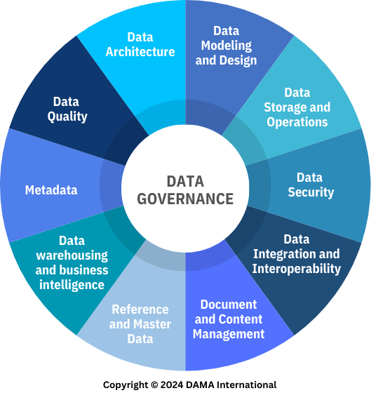

# Data Governance

Notes from [the Pluralsight learning path on Data Governance Literacy](https://app.pluralsight.com/paths/skill/data-governance-literacy). 

## Key Components and Frameworks

### Understanding Data Governance

#### What is Data Governance

Data Governance is the systematic oversight of an org's data assets to ensure data quality, security, privacy, compliance, and usability. While aligning data practices with business objectives.

Data Quality ensures data is good and leads to the right outcomes. Security and privacy ensures we have proper control over access, proper encryption where needed (transit, storage), proper data masking, and proper disposal. Compliance ensures all data handling and processes comply with legislation. Usability ensures people maximize the potential of their data, using data catalogues,  data dictionaries, data documentation, data lineage (these are all called Metadata Management). This maximizes potential, and minimizes risk. 

A data governance program includes:
- policies and standards (e.g., data sensitivity policy)
- data stewards (manage and ensure quality, security and compliance of data within business units)
- metadata management
- data quality assurance (continuous development of data quality tests and fixing issues)
- communication and training (clear docs, engaging trainings, ongoing meetings, ongoing reports)

Roles And Responsibilities:
- Data Governance Committee: policy development, strategic direction, communication, resource allocation, monitoring and reporting, change and risk management
  - Data Governance Director: main leader
  - Data Stewards: apply policies. Usually one or more for each business unit.
  - Department representatives
  - Data Governance Coordinator: tracks activities
  - Data Governance Analyst/Architect: makes sure technical application of policies is correct
  - Data Owners: mapped to a specific dataset/domain, familiar with the data and the policies applied to it, they apply or supervise policies, approve security changes, and are the final decision-making authority on their domain.

Business units will have inside them different data domains, datasets, platforms, etc.

### Understanding Data Governance Frameworks

A structured approach to planning and implementing data governance. It includes guidelines, processes, best practices, clear roles and responsibilities, scalability, regulatory compliance, consistency. There are many frameworks out there, we are going to cover just two: the Data Management Association International (DAMA) Framework, and the Control Objectives for Information and Related Technologies (COBIT) Framework.

DAMA is development by a non-profit, and the main text is called the DAMA-DMBoK. It defines data governance as the exercise of authority and control (planning, monitoring, enforcement) over the management of data assets. COBIT is a generic IT governance framework, not data specific, but it has a lot of data-related processes.

> Image: the DAMA wheel

These frameworks won't cover every business scenario, don't cover technical details, don't make decisions for you, and don't replace domain/organizational knowledge. Choosing a framework can be done using selection criteria: needs, objectives, org structure, transparency, industry alignment, scope of governance mandate, maturity/readiness, organizational culture, resources available, flexibility/adaptability. Frameworks can even be mixed and matched.

Implementing a data governance framework requires:
- executive sponsorship
- clear objectives and scope
- resource allocation
- a timeline

Usually there will be an assessment of the organization. The assessment uncovers the structure, processes, regulations, data assets. The frameworks usually need to be tailored to the company, then a detailed project plan is created. The plan includes initial objectives, resources/timelines, the framework activities, and the output is a detailed plan.

## Understanding Data Quality And Normalization

Data quality pertains to accuracy, reliability, and relevance of data in an organization. It's the responsibility of the whole company, not a person or team.

Quality can be measured using dimensions such as:
- Accuracy: error-free, correct
- Completeness: no missing values, data is as expected
- Consistency: data is uniform in format and content (e.g., date formats, conventions)
- Timeliness: data is not outdated, new data is available when needed
- Validity: data conforms to defined rules (email format, age range, etc.)
- Uniqueness: no duplicates for things that should be unique

Poor quality directly affects business outcomes. Data Stewards monitor, document, educate, and enforce data quality. Data owners have accountability for specific datasets/domains.

Best practices:
- Data profiling: detecting anomalies like duplicates, missing values, outliers, etc.
- Data validation: preventing errors at ingestion time, manual or automated checks
- Data cleansing: fixing errors, merging records, updating records, etc.
- Data completeness: handling missing records or values
- Data documentation: dictionaries, table relationships (cardinalities), metadata, lineage

### Database Normalization

Data should be standardized, under common units, common language, and with naming conventions. Data should also be organized in the appropriate platforms and schemas.

Normalization is the process of reducing data redundancy, and may lead to improved query performance in some cases. Some normal forms are:

- 1NF: atomic values (one value per cell), primary keys, no repeating rows or cols
- 2NF: 1NF + no partial dependencies (all other rows depend on the primary key)
- 3NF: 2NF + no transitive dependencies (ex: if you have country name and country code in a table, you would split that into two tables)

## Understanding Data Management

Data management entails data platforms and compliance. Ensures data is collected efficiently, stored, processed, and retained correctly. It regulates access to data via control policies. Data can is always sensitive, and must be protected. Data must have retention and clean-up policies in place.

Personally identifiable information (PII) is any data that can be used to identify an individual, directly or indirectly. Processing and storage of PII is highly regulated. PII can be anonymized.

Data modelling and storage are part of data management. Regulations apply to relational databases, data lakes, document storages, graph databases, back-ups, etc. Usually there are risk officers doing the regulation. Data access should be granular, and strict. Data audits should be possible and easy.

Policies are usually part of metadata, which also needs to be stored, and must not expose anything. Data management of metadata is called Metadata Management. This process assigns risk and sensitivity levels to data.

The data manipulation framework used in an org must allow engineers to guarantee data quality. Data storage solutions must allow for privacy and security controls. Data platforms must have high availability, encryption, access controls, and update processes. Accounts should be created with least privileges.

Long-term storage (cold storage) also needs to be compliant and validated (e.g., via checksums). Backups need to be redundant. Requests for data removal should be respected across the whole ecosystem (typically within 90 days). Regulations may allow data to be anonymized instead.

## Understanding Data Privacy And Security

Data governance strives to create a single source of truth about where each dataset resides, 
what it signifies, and it's relevance to daily operations. 

Common regulations: HIPPA (healthcare), GLBA (financial), FERPA (education), GDPR (EU), PCI DSS (payment card industry).

Data security standards: NIST CSF (information governance), FedRAMP (cloud security), ISO 27002 (information security), SCF (cybersecurity), CIS Controls (cybersecurity), NIST 803, HITRUST (healthcare), SOC2 (service organization)

Techniques: 
- access controls: classification of assets, user authentication, user authorization, segmentation
- encryption: data is encrypted, disk is encrypted, data in transit is encrypted
- availability: redundant storage, backup and recovery, disaster recovery, business continuity
- auditing: monitoring, logging, alerting, incident response

### Risk Management

- data asset classification: categorizing data based on sensitivity and criticality. Categories need criteria, owners, training, and periodic reviews.
- identifying and assessing risks: ISO 27005 (risk management), NIST SP 800-30 (risk assessment), FAIR (quantitative risk analysis), OCTAVE (organizational risk assessment)
- risk mitigation (compliance != security): legal compliance, security standards, data handling procedures, data retention (erasure) policies, audit and monitoring (and penetration testing).
- quality metrics: % of data encrypted, % of data access requests approved, mean time to detect and respond to incidents, successful security audits/year, # of data incidents mitigated, % of employees trained.

## Operations And Best Practices

Data Governance VS Data Management: governance is the systematic oversight (strategy and policy), while management is operations (technical and administrative tasks).

A Governance Programme consists of Policies, Stewards, Metadata Management, Data Quality, and Communication and Training. This is planned, implemented, and managed by the governance Committee. The committee develops policies, strategy, communication, resource allocation, monitoring and reporting, change and risk management. 

You start the program by defining the program framework, then policies and standards, then stewardship, metadata management, and data quality assessments. The program management supervises the organization, making sure it's following the plan,  the resources are allocated properties, and the goals are being met. Usually there is a data governance director, data stewards, department representatives, a coordinator, and a data governance analyst/architect.

Some of the challenges include: changes in executive sponsorship, resistance to change, underperforming roles, data silos, major data quality issues, poor awareness, poor visibility, loss of momentum, complex regulatory environment.

Some of the future trends include: sophisticated governance software, more collaborative models (data fabrics, meshes, etc.) on-premise/cloud hybrid models, unstructured and structured data blends, governance of ML/AI, and new regulations on privacy and AI.