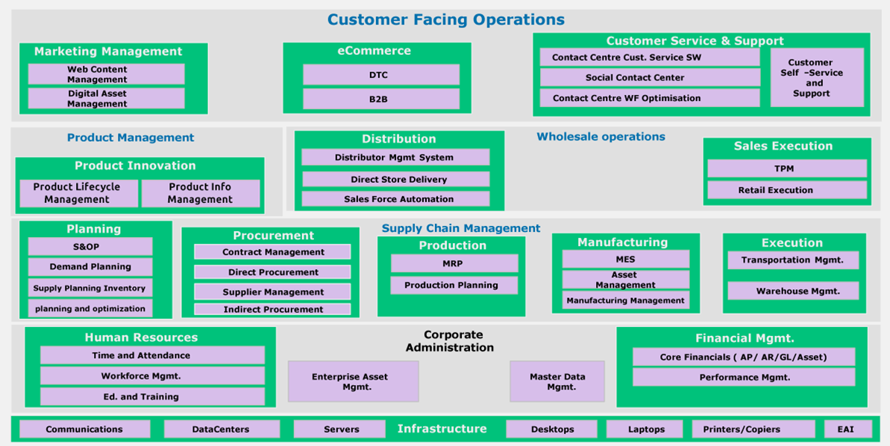
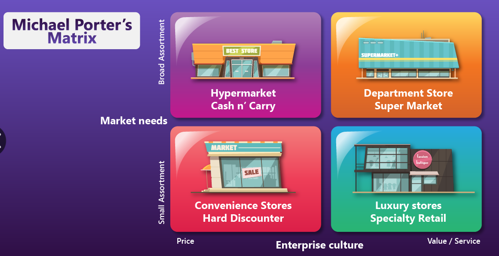

# Consumer Industry - Beginner

## Consumer Products Part 1

A consumer good is a tangible commodity, to be consumed by a consumer, for their want or need. They are consumer, rather used in the production of other goods

A vast number of consumer goods brands are controlled by about 10 multinational corporations. Kellogs, MARS, Unilever, Nestle, Procter & Gamble, Coca-Cola, PepsiCo, Johnson & Johnson, Kraft, etc.

A consumer products (CPG) are classified as fast-moving consumer goods (FMCG) or fast-moving consumer durables (FMCD).

Retail is and CPG go together. Think of retailers like Walmart, Target, Amazon, Costco, etc.

The CPG industry is currently facing a number of challenges, such as customer's demand for constant new product (think new fashion style); retailers started becoming adversaries rather than partners, by developing their own private brands; the supply chain has become very complex. Other challenges include multi-channel customers, regulatory compliance, and sustainability.

Some of the trends include the way many companies found ways to reach consumers directly, through online sales; demand-driven supply-chain management (volatile stocks), focus customer centricity/experience, accelerated product development, traceability, and a decline in brand loyalty.

### CPG Value Chain

The primary activities are: Planning products, Sourcing materials, Making products, Moving products, selling products, and supporting customers.

Support activities include accounting, IT, IT Ops, HR, Compliance, Legal, Infra, Procurement.

Value-Creation is done by competitive pricing, low manufacturing cost, brand image, and response to threats/opportunities.

### Supply Chain Management

The supply chain includes everything from the supplier or raw materials to the customer. A CPG company needs to eliminate inefficiencies all across the chain. This is where Supply Chain Management comes in.

Profits are driven by selling the right product, in the right time, in the right quantity, in the right store, at the right price, for the right customer.

#### Detergent Example

- **Timber** industry sources **paper** for a manufacturer, who sources paper for a **packaging** company.
- Oil company sources **plastic** to a **plastic cup** manufacturer
- A detergent manufacturer sources the paper and plastic, chemicals from a **chemical** manufacturer
- The produced detergent then goes to a **distribution** center, a **supermarket**, and finally to the **consumer**

As you can see, at least 6 industrial partners are involved directly and indirectly.

### Key Industries

- Beverages: Coca-Cola, PepsiCo, Red Bull, ABInBev, ...
- Household Cleaning/Cosmetics: P&G, Unilever, Colgate-Palmolive, L'Oreal, ...
- Food and Nutrition: Nestle, Kraft, Danone, ...
- Clothing and Apparel: Adidas, Nike, LVMH, etc.
- Durables: LEGO, Hasbro, ...

#### Direct Store Delivery (DSD)

A business process to distribute goods directly to retail stores from the manufacturer. Think of a beverage company delivering goods directly to small retailers (this would be a 2-tier DSD). A 3-tier DSD would be a beverage company delivering to a distributor, who then delivers to the retailer.

### Key Supply Chain Areas And Metrics

- Sourcing/Procurement: cost saving, quality of goods, on-time delivery, procurement time, contract compliance, spend as % of total spend, days payable outstanding
- Production/Planning: planning cost, production time, rescheduled orders, return on capital
- Brand management: brand awareness, engagement, brand equity, demand elasticity
- Order fulfillment: on-time delivery, case fill rate (CFR), order accuracy, order time, perfect order completion
- Sales/Marketing: order process time, customer retention, new customer rate, sales forecast accuracy, product availability in time, market share growth
- Retail Execution: out-of-stock rate, display conversion rate, sales admin time, success rate of new products
- Logistics/Distribution: cost, on-time delivery, transit time, case fill rate, shipment visibility
- Warehouse management: inventory accuracy, order picking accuracy, put away accuracy, resource utilization, resource handling, warehouse cost, truck turnaround time
- Product lifecycle management: time to market/shelf, new product success rate, new product output, direct material cost, rework, value of obsolete inventory
- Demand forecasting: forecast error/accuracy, mean forecast error, mean absolute deviation, MAPE/MAPD, tracking signal
- Trade promotion management: promotion uplift, promotion cycle time, effectiveness of promotion, accuracy of promotion forecast.

### Supply Chain Software

(most of these do all of them)

- Plan: SAP, Anaplan, Kinaxis
- Source: Coupa, ARIBA, Ivalua, Infor
- Make: SAP, Manhattan
- Move: JDA, Oracle
- Sell: Salesforce, Hybris, IBM

> Image: full IT architecture of a CPG company

Digital transformation has impacted all parts of businesses.

#### Integrated Business Planning (IBP)

Data is unified across the org, and used for central planning. The result is an uplift in many key metrics.

#### Demand Sensing

A forecasting method to collect real-time forecasts of the supply chain.

#### Intelligent Packaging

Packaging that can interact with the consumer, and provide information about the product. Can include markers that change color when the product is expired, or an NFC tag that can be scanned to get more information about the product.

#### Direct-to-Consumer (D2C) Trends

- 87% customers prefer purchasing directly from brands
- 82% manufacturers improve relationships via D2C
- 54% manufacturers reported increased brand awareness
- 42% CPG brands sell D2C
- 76% manufacturers reported improved CX
- 61% orgs plan to re-platform their commerce solution

#### Supply Chain Control Tower

An attempt to bring end-to-end visibility to the supply chain, by collecting data from all parts of the chain, and providing insights and recommendations to improve it. Level 1 is visibility, level 2 is alerts, level 3 is decision-support, level 4 is automation.

## Retail Part 1

Retail happens when a person buys a product for consumption. Purchase that is not for consumption is not retail.

Retail Value Chain: a manufacturer sends products to distributors or wholesalers, who then send them to retailers. The retailers sell those products to customers. Wholesalers are not retailers because they sell in bulk. Restaurants are not retailers because their value is in food preparation (no product for consumption is being taken).

A retailer adds value by: providing assortment of products/services, breaking the bulk (selling in smaller quantities), holding inventory, and providing additional services. 

The retail industry is a lot more distributed than the manufacturing one. The top 250 retailers hold 2% of the market.

How do retailers differentiate themselves?
- customer service (nordstrom)
- store design (apple)
- sales channels (argos)
- location (walgreens)
- product portfolio (wholefoods market)
- pricing (walmart)

### Porter's Matrix

> Image: retailers can be organized into 2 dimensions: assortment and price.

### General Merchandiser

Retailers who sell a wide variety of products, like department stores, supermarkets, hypermarkets, convenience stores, hard discounters, cash&carry, or warehouse clubs.

### Specialty Retailers & Category Killers

Retailers who sell a narrow range of products, but with a deep assortment. Category killers are specialty retailers that have a dominant position in their category.

### Retail Channels

Vending machines, Social, Messenger apps

### Cross-channel strategies

- Awareness channels
- Choosing channels
- Transaction channels
- Delivery channels
- After-Sales channels

Buying Journey: Awareness -> Choosing -> Transaction -> Delivery -> After-Sales

Retailers can be categorized as: electronics, fashion, health & personal care, food, and hard goods.

### Retail Trends

Last Mile Delivery, Experiential Retail, Personalization, Omni-Channel, Brand Loyalty

IT Priorities: revenue growth, digitalization, customer experience, operational excellence

Hot Tech: microservices, extended reality, automation with robots, AI, frictionless retail

### Core Processes

- Merchandise Management: right quantity, right products, right place, right time
  - category management
  - price management
  - promotion management
  - presentation planning (planogram - blueprint for store layout)
- Supply Chain: match supply and demand in a cost-effective way
  - Order fulfillment
  - Push model: maintain inventory, forecast demand. Allocation process.
  - Pull model: no inventory, produce on demand. Replenishment process.
- Store Operations: where most of the staff is engaged. Stores have selling areas, and back areas.
  - Store layout
  - POS (point of sale): sale, billing, receipts, discounts, loyalty cards, ...
  - back store management
- Digital Customer Experience

## 

## Quick Service Restaurant

A Restaurant is a place where customers pay to eat on the premises. Restaurant, from French, means to restore.

This industry faces intense competition. It's loosely broken down into quick service, or full service. The main factor here is convenience, speed of service, and ambience.

A restaurant, although sometimes called food retail, is not a retailer. Restaurants often don't need to pay employees minimum wage. They require licenses, and face more food waste issues.

Restaurant operations:
- structure: restaurants can operate on kiosks, or on-premise sit-in/take out
- ownership: can be either a brand (starbucks) or owned business/franchise (mcdonalds)
- food services: vary on the type of food provided

Quick service includes QSR (typically fast food), Food trucks, and fast casual. Full service includes casual dining, fine dining, and family dining.

### Store Architecture (quick service)

- Front of house: counter (POS, switch, router, modem)
- Back of house: inventory, printer, lavor, waste, menu management, tax, promotion and pricing

### Restaurant Formats

| Format        | Size (sqft) | Investment (K USD) | Employees | Customer Spend (USD) |
| ------------- | ----------- | ------------------ | --------- | -------------------- |
| QSR           | 400         | 200-500            | 7         | 13-30                |
| Fine Dining   | 5000-10000  | 500-1000           | 25+       | 75-150               |
| Casual Dining | 2000        | 350-700            | 15        | 50-75                |

### Cross Channel Strategies

- Awareness: offers, kiosks, marketing, promotions
- Choosing: reviews, online availability, nutritional info, menu visualization, combo guides
- Transaction: loyalty cards, coupons, mobile payments, micro-payments
- Delivery: few-hour, additional services, real time tracking, uberization
- After-Delivery: feedback, cash back

### Customer Touchpoints

- Order
- Menu
- Payment
- Delivery
- Loyalty

### Trends

- Digital ordering, virtual ordering (ghost kitchen), 
- off-premise ordering, 
- menu management, 
- different payment options (crypto, facial, mobile, contactless), 
- delivery (robots, drones fleets, contactless)

### Core Processes 

Menu Management > Supply chain > Store Ops > Franchise Management > Business Intelligence > Digital Customer Experience

