# Transformers & LLMs

Stanford CME295. Source at [Stanford Online on Youtube](https://www.youtube.com/playlist?list=PLoROMvodv4rOCXd21gf0CF4xr35yINeOy). Nine 2-hour lectures.<br/>
Adjunct Lecturers from Stanford University: [Amidi, A.] and [Amidi, S.].

Disclaimer: I have a background in machine learning, deep reinforcement learning, and recommender systems, so I skipped a lot content that felt basic to me, and selfishly focused on notes that were more meaningful to me.

## Transformers

### NLP Overview

Natural Language Processing use cases:
- **Classification** (output is a class): 
  - Examples: sentiment extraction, intent detection, language detection
  - Training: trained on reviews, social posts. Evaluate by using typical traditional ML classifiers.
  - Metrics:
    - Accuracy: % of predictions correctly predicted
    - Precision: % of predicted positives that were correct
    - Recall: % of actual positives correctly predicted
    - F1: harmonic mean of precision and recall
- **Multi-classification** (output is a class for each input word):
  - Examples: named entity recognition (NER, label words as location, time, person, etc.), part of speech tagging (noun, verb, etc), dependency parsing, constituency parsing.
  - Training: annotated text data (i.e. newspapers)
  - Metrics: classification metrics - at the token level or at the entity-type level
- **Generation** (output is different text)
  - Examples: machine translation, question answering, summarization, etc.
  - Training: pair-wise (sentence-output) datasets
  - Evaluation (referenced-based metrics):
    - BLEU: quality of text translated (similar to precision)
    - ROUGE: quality of text generated (similar to recall)
    - Perplexity: quantifies how "surprised" the model is to see words together

### Tokenization

Quantify text into units (tokens). Can be done at word-level, or character-level, but these come with cons Sub-word tokenization example (algorithms WordPiece, BPE):

> A cute teddy bear is reading.<br/>
> [a] [cute] [ted] [##dy] [bear] [is] [read] [##ing] [.]

This is slower than word-level, and has more Out-Of-Vocabulary (OOV) errors than letters.


### Word Representation

- Learned embeddings (word2vec): neural network with a proxy task over a large corpus.
  - CBOW: continuous bag of words (predict word from words around that word)
  - Skip-Gram: predict words around a target word 

> The cat sat on the mat<br/>
> The cat [<u>sat</u>] on the mat.


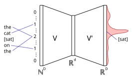
> Image: CBOW neural network architecture [[source](https://en.wikipedia.org/wiki/Word2vec)]. $D$ is the corpus size, $d$ is the embedding size. 
 
Each input is the count of a word. Output is probability of next word. Hidden layer is the embedding. The architecture works pretty much the same as an auto-encoder.


### RNNs

Previous representations are token-specific, regardless of where the words are. RNNs (recurrent neural networks) consider tokens sequentially (order matters). You do this by keeping a hidden state (representation of sequence processed so far).


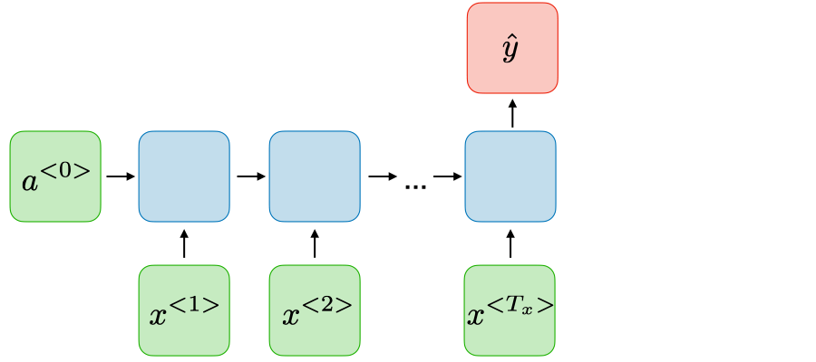

> Image: Example of an architecture for sentiment classification. [[source](https://stanford.edu/~shervine/teaching/cs-230/cheatsheet-recurrent-neural-networks/)]. Each vector $x^{<i>}$ is the embedding of the $i$-th token (i.e., token at time $T_i$). The blue boxes are the hidden state. $a$ is the activation, and $\^y$ is the output.

This architecture has issues with "long range dependency" (i.e., vanishing gradient, can't remember what it saw in the past, only the current state of things). LSTMs (GRU generalization) is an approach to keep track of "important" information from the past (see seq2seq).

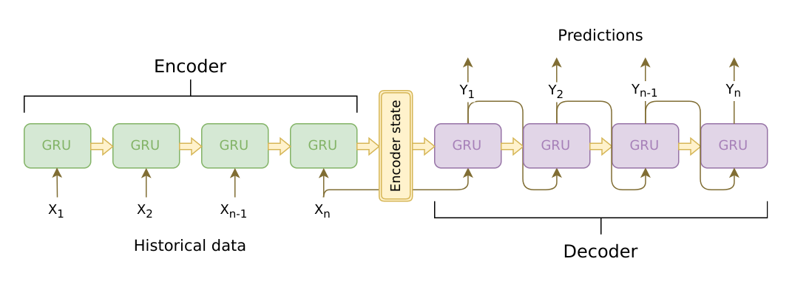
> Image: seq2seq architecture [[source](https://github.com/sooftware/seq2seq)]. Sequence of tokens are encoded and decoded using an RNN with GRU cells.

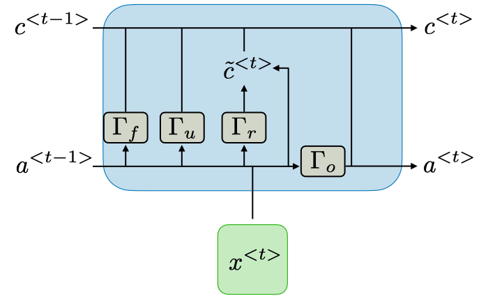
> Image: detail of a LSTM cell [[source](https://stanford.edu/~shervine/teaching/cs-230/cheatsheet-recurrent-neural-networks/)]. The idea is to create a gates (gamma, $\Gamma$) for update ($\Gamma_u$), relevance ($\Gamma_r$) and for forgetting ($\Gamma_f$). Output is a combination of all of them.

### Self-Attention

Self-attention mechanism is an improvement on this, and tries to predict which past tokens were important in predicting the current one. Instead of keeping the gates, tries to have the model connect directly to previous tokens.

We take a query $Q$ (a vector), compare it with the value $V$ (also vectors) of each other key $K$ (vectors too). This can be done very efficiently using matrices:

$$ softmax (\frac{QK^T}{\sqrt{d_k}})V $$

Here $T$ means transposed. The dot-product of $QK^T$ is normalized by $\sqrt{d_k}$ to prevent it from growing too large. 

The goal here is to learn the values for the relationships between the queries and the keys. 

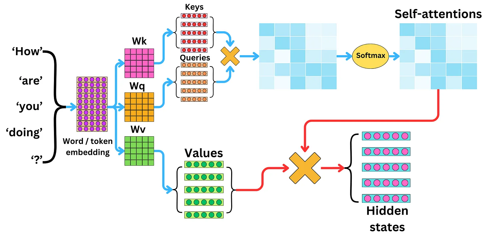

> Image computation of keys, queries, and values vectors [[source](https://newsletter.theaiedge.io/p/understanding-the-self-attention)].

### Transformers

Multi-head attention (MHA): an encoder with self-attention, and a decoder with self-attention. Encoded tokens are rich representations of the input tokens. The representations from the input sentence are used to figure out what to predict next. Keys and values come from the encoder, and the query comes from the decoder.

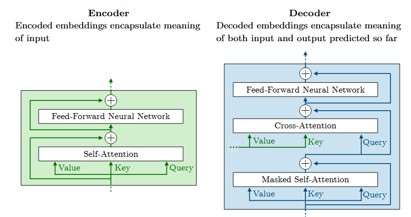
> Image: details of the transformer encoder and decoder.

1. Text is first tokenized, embedded, positional encoding is added. 
2. Then it goes through the encoder with multi-head attention, feed-forward, and normalization.
3. Then we start the translation with the decoder (the BOS token, beginning of sentence). The first masked multi-head attention figures out what the next token is.
4. Then we have another multi-head attention that combines outputs of the encode and the decoder.
5. Then we have another feed forward and normalization steps.
6. Then we have a linear projection and a softmax final layer to determine probabilities of next token.


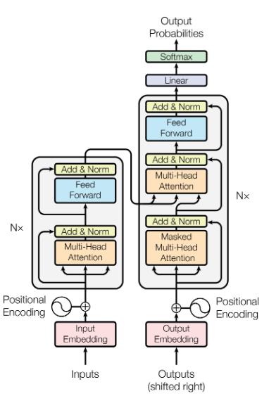
> Image: full transformer architecture [[source](https://arxiv.org/abs/1706.03762)].

Multi-head means several self-attention layers run in parallel. Analogous to multiple convolution filters in a CNN.

The [Attention is all you need](https://arxiv.org/abs/1706.03762) does not do this, but recent models add noise to targets (i.e., labels, the technique is called label smoothing) that helps fight over-fitting. This reminds me of noisy layers from [Noisy Networks for Exploration](https://arxiv.org/abs/1706.10295), but instead of building it into a layer, noise is added to labels.

### End-To-End example

- Start with a sentence
- Tokenize the sentence ($k$ tokens)
- Get embedding of each token (size $d$)
- Get position-aware embedding of each token (size $d$)
- We now have a $k \times d$ matrix, which is the input to the transformer encoder.
- For each encoder:
  - For each head:
    - Project the input into 3 spaces: $W_Q$, $W_K$, $W_V$ to get the queries $Q$, keys $K$, and values $V$. The spaces $W$ are weights learned by the model.
    - Then we apply self-attention on Q, K transposed, and V.
  - Another learned layer $W_O$ combines the outputs of the heads, projecting it back to the original space ($k \times d$). This is the encoder output.

Q, K and V all have $k$ rows. Clearly $QK^T$ gives us a matrix of size $k \times k$. The $softmax$ output is a vector of size $k$ representing the "importance" of each token.

The $N$ outputs from the $N$ encoders are sent to the $N$ decoders.

- The decoder starts with the first token (BOS, beginning of sentence). 
- This token goes through its own self-attention layer, which is masked (i.e., it can't see the future tokens).
- The output of the above goes through another multi-head attention layer, which combines it with the output of the encoder. The keys and values come from the encoder, and the query comes from the decoder.
- Then there is a linear projection and a softmax layer to determine the probabilities of the next token (over the whole vocabulary).
- The predicted next token is fed back into the decoder. And the process repeats.
- When an (EOS, end of sentence) token is predicted, the process stops.

## Transformer-Based Models & Tricks

### Position Embedding

Remember that usually in embeddings, we evaluate the similarity of two things using their dot product. For example, cosine similarity is the dot product of two vectors divided by the product of their magnitudes. $cos(v_1, v_2) = \frac{v_1 \cdot v_2}{\lvert v_1 \rvert \lvert v_2 \rvert}$.

So we can create an embedding vector alternating sine and cosine functions for even and odd dimensions, respectively. Imagine we have an embedding space of size $d$, for a token at position $m$, we can compute the i-th position ($2i$ when even, $2i+1$ if odd) of the embedding as $sin(\frac{m}{\omega})$ for even positions, and $cos(\frac{m}{\omega})$ for odd positions. Here we just simplify the notation by defining omega as $\omega = 10000^{\frac{2i}{d}}$.

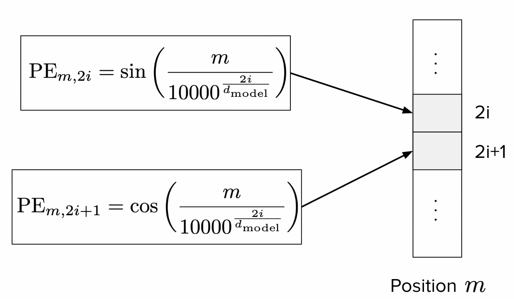
> Image: sinusoidal position embedding, detail of calculation of embedding positions. [[source]](https://cme295.stanford.edu/slides/fall25-cme295-lecture2.pdf)

These are called sinusoidal position embeddings, and they were used in the original transformer paper. Below we will see other modern techniques.

#### T5 Bias

T5 (Text-to-Text Transfer Transformer) is an alternative idea to positional embedding, that adds a learned bias to the attention layer. By adding the term $bias_{m, n}$ (where $m$ and $n$ are the positions of the query and key, respectively) to the $softmax$ term, the model can learn the relationship between the query and key positions. See [Raffel et al., section 2.1 (second-to-last paragraph)](https://arxiv.org/pdf/1910.10683) for details. 

The bias, added to each query-key score is dependent only on the distance between them $\beta(m-n)$. Clearly if $m=n$ the bias is zero.

#### Attention with linear biases

Attention with linear biases (ALiBi, see [Press et al., section 3](https://arxiv.org/pdf/2108.12409), which includes a good summary of T5) replaces the learned bias with a deterministic (static, non-learned) formula for the bias $b = (m \cdot [−(i − 1), ..., −2, −1, 0])$

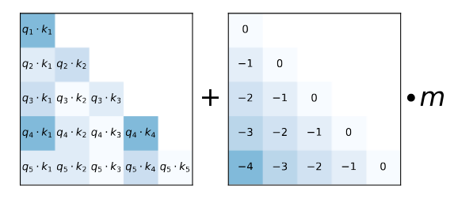
> Image: ALiBi, sample static bias matrix to penalize tokens that are further apart [[source]]((https://arxiv.org/pdf/2108.12409).


#### Rotary Position Embedding

Rotary Position Embedding (RoPE) rotates the Key at position $m$ and the Query at position $n$ by some angle $\theta$  (remember that rotating vectors is done by multiplying matrixes). See [Su et al., section 3.2](https://arxiv.org/pdf/2104.09864) for details.

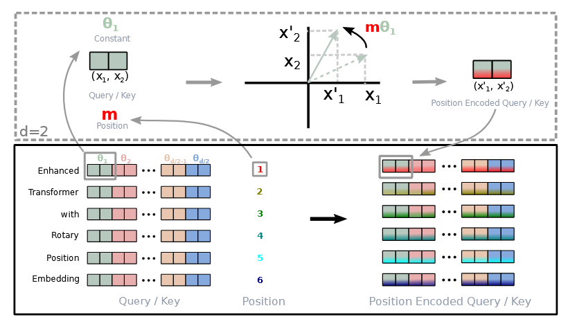
> Image: RoPE, 2D sample rotation of query and key vectors to capture relative position between them [[source]](https://arxiv.org/pdf/2104.09864).

$\theta$ is a parameter that depends on the position of the query and key, the authors define it as $\theta_i = 10000^{\frac{-2i}{d}}$. Similar to our previous $\omega$ from the sinusoidal position embedding. This provides a long-term decay of the angle, which is desirable because we want to capture the relative position between the query and key, and we want to penalize more the tokens that are further apart.

Working out the math, we end up with a nice formula that captures the relative position between the query and key. Most new models use this approach.

### Layer Normalization

At several steps of the Transformer architecture, we add Layer Normalization (LN) steps. This scales the output vectors by a (learned) weight $\gamma$ and shifts them by a (learned) bias $\beta$. 

$$LN(x) = \gamma x + \beta$$

In practice, this improves training stability and convergence time. It was in the original transformer paper, LN was applied after the multi-head attention and feed-forward layers (post-norm).

Newer models instead add it before the MHA and FNN (pre-norm). Additionally, an improved normalization function (RMSNorm, for root mean square) is also used, which normalizes the vector and drops the bias term: 

$$\gamma \frac{x}{RMS(x)}$$

### Attention Approximation

The idea here is to try smaller attention matrices, that do not harm performance. The authors of the paper, see [Beltagy et al.](https://arxiv.org/pdf/2004.05150), tried different approaches:

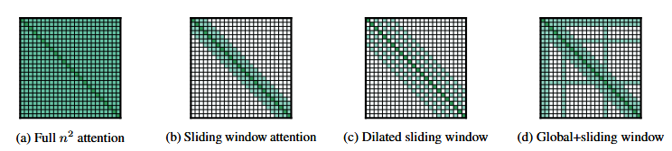
> Image: different attention approximation techniques [[source]](https://arxiv.org/pdf/2004.05150).

This last one, called sliding window attention (SWA), interleaves local attention with global attention layers. This is similar to the idea of a receptive field in CNNs.

#### Shared Attention Heads

The idea here is to share the weights of the attention matrices of keys and values across heads (but not the queries). This saves a lot of memory and computation, and does not harm performance. 

If the attention heads are grouped into one, this is called Multi-Query Attention (MQA, see [Shazeer, M.](https://arxiv.org/pdf/1911.02150), section 3). When there are more groups (but still less than the number of heads), this is called Grouped-Query Attention (GQA, see [Ainslie et al.](https://arxiv.org/pdf/2305.13245)).

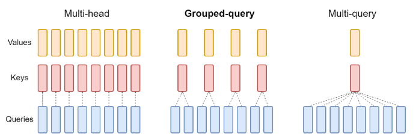
> Image: shared attention heads, sample architecture with 4 matrices and 1 [[source]](https://arxiv.org/pdf/1911.02150).


### Transformer-Based models

There are 3 categories of transformer-based models:

1. Encoder-Decoder: text-to-text transfer models, like T5, mT5 (multilingual T5), ByT5 (tokenizer-free T5, operates at the byte level, each character is represented as 2 bytes).
2. Encoder-only: Projection of embedding for class prediction (e.g., sentiment extraction), models like BERT, DistilBERT, RoBERTa.
3. Decoder-only: text-to-text, GPT series.

The first two were more popular in 2018-2022, but the decoder-only models are more used now.

### Bidirectional Encoder Representations from Transformers (BERT)

As the title says, this architecture drops the decoder from the transformers model. Having *bidirectional* representations in this context refers to the fact that the multi-head attention in the encoder attends to all tokens in the input sequence (past and future) as opposed to the decoder MHA which is masked. See [Devlin et al., section 3](https://arxiv.org/pdf/1810.04805).

At the beginning of a text sequence, a CLS token (classification) is added. Sentences are separated by a SEP token. The model first is pre-trained on proxy tasks: MLM (masked language model, model learns the internal structure of the input) and NSP (next sentence prediction, model learns the ordering of sentences). Then, the model is fine-tuned on the desired task (this step, although required, does not need a lot of data). This model is not suited for text generation.

Pre-training:
- BERT starts with a tokenizer called WordPiece, which is trained separately. It has a large vocabulary (30k). It also adds pre-processing steps for NSP/MLM, such as adding [CLS] (class), [SEP] (separator), [MASK] (target), and [PAD] (padding) to inputs.
- Tokens are then embedded using a "hardcoded" gigantic lookup table (trained separately). Each word has its own unique embedding. Then, positional encodings are applied to the token embeddings.
- A novel approach BERT has is that the embeddings also receive also a "segment encoding" layer, which is a (learned) flag to represent a sentence that precedes another one.
- The embeddings go through the normal transformer encoder with MHA and FFN
- Then we have two outputs for the training tasks both with (linear layer(s) + softmax output layer):
  - MLM Output probabilities: model learns based on contextual information. 80% of tokens are masked (the learning goal), 10% tokens are unchanged, and 10% are randomized (reflects the probabilistic nature of language).
  - NSP Output probabilities: model learns the relationship between sentences (if sentence A and B are consecutive). 50% of sentences follow each other, 50% don't. Easy binary classifier.

Hyperparameters:
- L: number of encoders
- A: number of attention heads
- H: dimension of the hidden layers (size of embedding space)

For instance, BERT-base has L=12, A=12, H=768, which yields ~110M parameters. Input data can be language-specific or multi-language, and text can be cased or uncased (i.e., if it was converted to lower case).

Fine-tuning (great for sequence classification like sentiment extraction, or token classification like question answering):
- weights are taken from the first task (trained on massive datasets)
- early layers are frozen (weights and biases don't get updated when fine-tuning)
- replaces MLM and NSP with a task-specific output layer (i.e., linear + softmax)

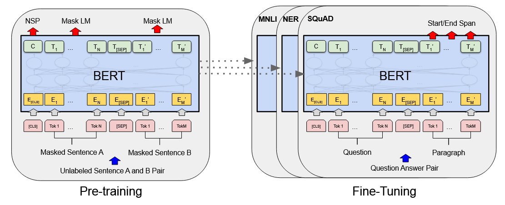
> Image: BERT architecture [[source]](https://arxiv.org/pdf/1810.04805).

BERT had SOTA results, is very adaptable, and has "true" context representations. However, it has a limited context window, and is computationally expensive.


#### Distillation

The idea of distillation is to train a smaller (student) model learn the prediction distribution of the larger model (teacher) instead of the hard labels. The objective function used for this is called the Kullback–Leibler (KL) divergence.

By reducing BERT's layers by half, the model becomes ~1.6x faster, at the cost of ~97% performance (see [Sanh et al.](https://arxiv.org/pdf/1910.01108)).

#### RoBERTa

[Liu et al.](https://arxiv.org/pdf/1907.11692) found out that you could drop the NSP pre-training task, and segment encodings altogether at almost no cost to predictive power. They also added dynamic masking across training epochs (as opposed to BERT, which had static masks), which improved performance. These researches also trained on a corpus 10x larger.

## Large Language Models

### LLM Overview

A language model assigns probabilities to a sequence of tokens. Large here means large number of model weights and biases (parameters), large training corpus (input tokens), and consequently high compute cost (GPU hours). For instance, GPT-3 (~175B parameters, ~500B input tokens) would have costed ~$5M, and taken about a month if trained on ~1K A100 GPUs.

These models are decoder-only. They have only the Masked MHA and FFN.

### Mixture Of Experts-based LLMs

Do we really need to go through all the parameters for a forward-pass inference? Maybe not all weights are useful for a given input.

The idea here is to train multiple "sub-models" (i.e., the experts) $E_i$, preceded by a gate $G$ (also called Router) which estimates the (learned) importance of each expert for an input. The output is the sum of all experts.

$$\hat{y} = \sum^{n}_{i=1} G(x)_i E_i(x)$$

If an expert $i$ is terrible at predicting a certain input $x$, the gate will penalize it by approximating $G(x)_i$ close to zero. This is a **dense** MoE, since it activates all experts (just weighs them).

The experts here are specifically the FFN bit of the decoder (because it's the larger part, the MHA part is much smaller). The MHA is shared across experts.

It gets interesting when we talk about **sparse** MoEs, which constraint the max amount of experts activated to a hyperparameter $k$. We would simply select the top-k $G(x)$ values. This drastically reduce the amount of operations (FLOPs) required for a forward pass. It allows models to scale up a lot, without a correspondent increase in compute cost. These models are also more sample-efficient, which means they learn faster.

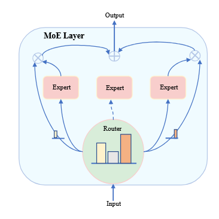

> Image: mixture of experts example [[source](https://arxiv.org/pdf/2503.07137)]. This would be a top-2 router, see how the middle expert is not activated. Each expert's output is multiplied by the router's correspondent weight, and the final output is the sum of the weighed experts' outputs.

#### Router Collapse

Sometimes experts end up being mostly ignored (biased router), this is called router collapse. This can be mitigated by a loss term $\alpha$, so that actor selection converges to a more uniform across experts. This auxiliary loss function can be expressed as $\alpha N \sum^N_{i=1} f_i P_i$, where $f_i$ is the percentage of tokens routed to expert $i$, and $P_i$ is the average probability of expert $i$ being selected. 

You can see how the more biased the router gate is (i.e., high $f$ and high $P$) the higher the loss. 

Another approach is to add noise to the router's output, so that it explores more experts (again, similar to noisy layers). 

### Response Generation

Given an input token (or sequence), we get a probability distribution over the vocabulary. Choosing $argmax$ (greedy decoding) over the distribution is not serendipitous nor diverse. It chooses the local optimum, but not the global one. Think about it like this: the best next token may not lead to the best sentence. A more suitable approach would be to use Beam Search, which keeps the $k$ highest probability paths.

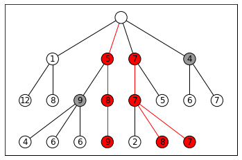
> Image: beam search example for k=3 [[image from wikipedia]](https://en.wikipedia.org/wiki/Beam_search). This approach however needs more computations, and still lacks diversity.

The more common approach is to simply sample from the highest likelihood elements of the distribution $\sim\mathbb{P}(w_{t+1} \mid C)$:
- Top-k sampling: sample from the top-k most likely tokens.
- Top-p sampling: sample from the smallest set of tokens whose cumulative probability exceeds a threshold $p$ (e.g., 0.9).


### Temperature

The probability distribution is given by the softmax output layer. LLMs add a constant to the Boltzmann distribution, the factor $T$ (temperature): 

$$ \mathbb{P}(w_{t+1} = w_i \mid C) = \frac{e^{\frac{x_i}{T}}}{\sum^n_{j=1}e^{\frac{x_j}{T}}}$$

That weights the sampling (you can imagine the default formula having $T=1$. In practice, low $T$ values end up creating more "spiky" distributions (lower entropy, more certainty), and high $T$ create more "flat" ones (higher entropy, more uncertainty). [Wikipedia (Softmax_function, see Definition)](https://en.wikipedia.org/wiki/Softmax_function) has a great section on this.

This is the only non-deterministic bit of the architecture. Any temperature $T>0$ value introduces inference randomness. 

This ends up of course not being true in practice unfortunately (see [this fantastic article](https://thinkingmachines.ai/blog/defeating-nondeterminism-in-llm-inference/) for a discussion on this topic):

> Floating-point arithmetic in GPUs exhibits non-associativity, meaning $(a+b)+c \neq a+(b+c)$ due to finite precision and rounding errors. This property directly impacts the computation of attention scores and logits in the transformer architecture, where parallel operations across multiple threads can yield different results based on execution order. - [Yuan et al.](https://arxiv.org/pdf/2506.09501)

So non-associativity plus parallelism in GPUs lead to non-determinism. The article above discusses ways to address this.

### Guided Decoding

During the generation process, filters out invalid next tokens (think of a markup language like JSON, which must start with a `{` or `[`, etc.)

### Prompting Strategies

First of all, let's clarify that input size can be called several things, usually some combination of `(content|context|window) (size|length|window)` (e.g., content length, context size, window size, context window). Modern models have large context windows (even millions).

NB: Context is not always helpful, and can in fact bias the model (see [this beautiful article on the subject of context rot](https://research.trychroma.com/context-rot)).

There's no formal theory on prompt design (and has become a bit of *"bro science"*). A format that has been shown to work well is the following:

```
[Context]
[Instruction]
[Input]
[Constraints]
```

I've also seen colleagues using the COSTAR framework [source](https://portkey.ai/blog/what-is-costar-prompt-engineering/).

### In-Context Learning

- Zero-shot learning: question is asked without any input-output samples.
- Few-shot learning: question is asked with a few input-output samples in the prompt. Typically works better, but requires effort, latency, and cost.

As reasoning models develop, making better instructions might eventually beat finite examples.

### Chain-of-Thought

Researchers found that forcing models to explain their predictions improves performance. It adds a certain level of interpretability/explainability, but at the cost of more compute. See [Wei et al.](https://arxiv.org/pdf/2201.11903), the abstract has a good sample CoT prompt.

### Self-Consistency

The idea here is to:
- Sample the model over several times
- Somehow parse the desired response from the output (a number, a target class, etc)
- Select the most consistent answer across predictions (e.g., majority vote)

See [Wang et al., section 1](https://arxiv.org/pdf/2203.11171).

### Inference Optimization

####  Attention layer improvements

We can cache Key and Value matrix representations of past input tokens (in a Key-Value storage, not to be confused with the transformer Key, Value, and Query concepts). A naive implementation would lead to a lot of performance issues. PagedAttention is a solution to this, which divides the input into pages (blocks), and only attends to the most recent page.

We can share the attention heads (GQA, from previous section) to reduce the amount of computations

We can try to reduce the size of Key and Value vectors (Multi-Head Latent Attention, see [[Meng et al.]](https://arxiv.org/abs/2502.07864)). For a given input token, we can project the Key and Value vectors into a smaller latent space (authors used PCA, principal component analysis), and then compute attention in that space. Moreover, compression matrices can be shared between Keys and Values (reduced cache space). The authors noted they compressed the LLaMa cache by ~70%, with a ~1.6% drop in performance.

#### Speculative Decoding

Ask a smaller LLM (called Draft) to quickly predict next tokens. Then the predicted draft tokens are used in the bigger LLM (called Target) to get their likelihood on the bigger model.

- If the computed probability of a token on the Target model ($Q$) is higher than the probability in the Draft model ($P$), we use it
- Otherwise, we accept the token with probability $\frac{Q}{P}$
- If a token is rejected, we re-sample it by sampling from the combined distributions $Q - P$.

This should, in theory, approximate to the Target model's distribution, but at a far lower cost. See [Chen et al.](https://arxiv.org/pdf/2302.01318) for the proof.

#### Multi-Token Prediction

This approach attaches $k$ output layers (linear+softmax) on top of the last decoder, to do multiple token predictions for the same input (next token $t+1$, next-next token $t+2$, $t+3$, ..., $t+k$).
Analogous to speculative decoding, the "Target" model is the first head, and the "Draft" models are all other heads. 

The next token is sampled from their corresponding heads, but other tokens are sped up by using a "self-speculative decoding" of the other heads.

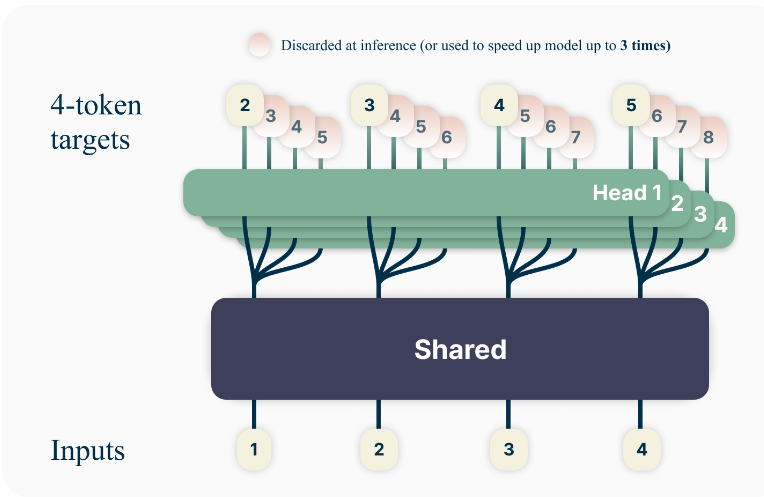
> Image: multi-token prediction example [[source](https://arxiv.org/pdf/2404.19737)]. Each head sampled 4 next tokens.

See [Gloeckle et al.](https://arxiv.org/pdf/2404.19737) for details.


## LLM Training

### Pre-Training

Unlike traditional supervised learning, we pre-train models on generic (massive) datasets and then later tune the weights to a specific task. The goal of pretraining is to learn the patterns of a language (or programming language, or multiple languages).

Training efficiency measurements:
- Common datasets include Common Crawl (web data), Wikipedia, etc. Source code can come from GitHub, StackOverflow, etc. When tokenized, we arrive at billions or even trillions of tokens (LLaMA 3 was trained on 15 trillion tokens).
- Total compute required to pre-train models is measured in FLOPs. LLMs can take north of $10^{25}$ FLOPS, while a small neural network can be trained with just $10^{7}$.
- Computational speed is measured in FLOPS (also written as FLOP/s) or floating-point operations per second. This notation is very often confused with the previous one.

Experimental results from 2020 [[Kaplan et al., section 6]](https://arxiv.org/pdf/2001.08361) showed that models do improve with more  (more training), more parameters (more layers), and more data (more tokens). They found bigger models are more "sample efficient", meaning they learn faster (i.e., they require fewer tokens to reach a certain performance level).

Furthermore, results from 2022 [[Hoffmann et al.]](https://arxiv.org/pdf/2203.15556) found that by fixing compute, and varying parameters/tokens, training loss follows a U-curve (they called it Chinchilla law), meaning there's an optimal configuration for each compute budget. The authors provided the following guide table:

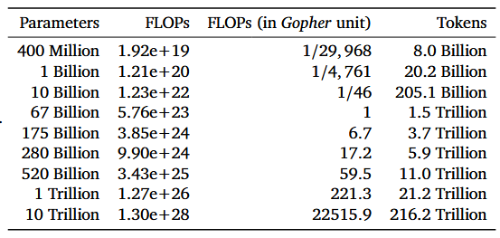
> Image: estimated optimal parameters for a given compute budget [[source](https://arxiv.org/pdf/2203.15556)].

Caveats:
- models don't learn things that it wasn't trained on (knowledge cutoff). Updating model weights has been shown to hurt the model overall.
- learned weights (which is unfortunately called "knowledge") cannot be easily edited or corrected
- several discussions about plagiarism, environmental impact, etc.

### Training Optimizations

- When training, the model will process a token $t$. 
- It activates the layers to obtain $\Theta_t$, and computes the loss (cross entropy) $\mathscr{L}(\Theta_t)$ (forward pass).
- Then, the gradient is calculated propagated back through the model $\nabla \mathscr{L}(\Theta_t)$ (backward pass/back propagation).
- An optimizer (e.g., Adam) updates the weights, according to a learning rate $\eta$ (hyperparameter).

The issue here is that a modern GPU's memory (~80GB) is not enough to store all the weights, activations, and gradients of a large model. 

#### Parallelism

This is tackled by a technique called Data Parallelism: the model is copied across multiple GPUs, and each GPU processes a different batch of data. After the forward and backward pass, the gradients are averaged across all GPUs, and the weights are updated synchronously. This introduces communication overhead, so training is slower.

An improvement to this is called ZeRO (Zero Redundancy Optimizer, see [Rajbhandari et al.](https://arxiv.org/pdf/1910.02054)). The authors found that the optimizer state was taking most memory, and that most of it was shared (as in duplicated) across GPUs. So they developed a way to share the optimizer state across the GPUs. They also found a way to partition gradients and parameters (ZeRO-3). Achieving no redundancy, but increasing the overhead.

Another set of methods, called Model Parallelism, which shares model computation across GPUs. See Tensor Parallelism (TP), Pipeline Parallelism (PP), Sequence Parallelism (SP), Context Parallelism (CP), Expert Parallelism (EP).

#### Flash Attention

GPUs have two kinds of memories, HBM (big and slow) and SRAM (small and fast).

Remember self-attention calculates the softmax of a big matrix $O = softmax(QK^T)V$. By default, each matrix is stored in HBM, the operation happens in HBM, and the result is re-stored in HBM. Softmax normalizes rows, so it needs to look at the each row (not the full table). Flash attention tiles the matrix, and performs smaller calculations in SRAM. 

Quick reminder of the dimensions, $(Q, K, V, O) \in \mathbb{R}^{N \times d}$, where N is the input size (number of tokens) and d is the embedding size (head dimension). This means of course that $(QK^T, softmax(QK^T)) \in \mathbb{R}^{N \times N}$.

Additionally, we don't need to have the full $QK^T$ (again, T is transposed) to start calculating the softmax result. We can do it column/row wise. One "block" (i.e., tile, slice) would contain: a row of $Q$, a column of $K^T$, a row of $V$. The output would be a row of $O$ (the attention result). Reading and writing from SRAM is way faster, so once we have a block of $O$, it's sent back to HBM.

The way this is used is primarily during the backwards pass. The idea of the Flash Attention paper is to recalculate the activation during back-propagation. This means that, once loss is calculated, the activations are discarded. They are instead recalculated (using the tiling technique) in SRAM during the backwards pass.

Counterintuitively, although this results in a increase in GFLOPs, it drastically reduces runtime and memory usage. See the IO analysis [on section 3.2 of the paper](https://arxiv.org/pdf/2205.14135). New GPUs come with new hardware, and therefore there have been newer implementations of FlashAttention.

#### Mixed Precision Training

CPU architectures allow definition of floating-point numbers with different precisions (16-bit, 32, 64). Reducing precision by half means a double increase in compute speed (while also taking up half the memory). Can we reduce precision in parts of training where we don't need it?

Turns out the answer is yes. We can keep inputs and weights in 32-bit precision (higher precision), but outputs (activations, forward pass) and gradients (backwards pass) can be done in 16-bit (lower precision). Weights are updated of course in the higher precision.

Performance was not degraded, but compute was faster, and memory usage was lower. Weights need higher precision to prevent accumulation of quantization errors.

### Supervised Fine-Tuning

SFT uses input/output pairs to optimize next word prediction. A special case (for assistants) is to train the model to answer instruction (instruction tuning). This prepares the model to be helpful in tasks like story writing, list generation, poem creation, explanation, etc.

This is done with a mix of data like assistant dialogs, instructions, mathematics, reasoning, code, safety alignment (train model to reject harmful queries, or to prevent models from spitting out blank statements aka "hedging"), etc. While originally this was human-written, nowadays these datasets can be generated by modern LLMs (and the quality can be reviewed by humans).

Fine-Tuning requires thousands to millions of tokens (as opposed to billions to trillions).

SFT requires very high-quality data, is difficult to evaluate, and is computationally expensive. An important thing to pay attention to when curating the data is to provide sparse enough data to cover as much as possible of the distribution space.

Here are some commonly used benchmarks:
- MMLU (tests general knowledge)
- Basic reasoning (ARC-Challenge)
- Math reasoning (GSM8K)
- Code evaluation (HumanEval)

#### Preference Tuning

Tuning the model to have a more "real-life" feeling, so the model doesn't "misbehave" as much. This also feels very much like *"bro science"* to me.

### Parameter-Efficient Fine-Tuning

#### Low-Rank Adaptation

LoRA starts by decomposing the weight matrix $W \in \mathbb{R}^{d \times k}$ into lower rank matrices $W_0 \in \mathbb{R}^{d \times k}$, $B \in \mathbb{R}^{d \times r}$ and $A \in \mathbb{R}^{r \times k}$, so that $W = W_0 + BA$. Here $r$ is the rank (hyperparameter, a small number, like 4).

Here $W_0$ is the pre-trained weight matrix, and we freeze it. So we just update weights on B and A. This had the added benefit that B and A become task-specific. Recent research (see [this nice blog post from Schulman et al.](https://thinkingmachines.ai/blog/lora/)) found that the FFN is the best place to apply LoRA.

LoRA needs higher learning rates, and requires smaller batch sizes (empirical evidence).

#### QLoRA

$W_0$, when stored, can be quantized in a lower precision than $A$ and $B$. There is a specific float implementation called NF4 (normal float 4-bit) that's used for this. It's a two-step process to quantize the weights, then quantizes the quantization constants.

The first quantization reduced VRAM during fine-tuning by a factor of 16, and the second an extra 6%. See [[Dettmers et al.]](https://arxiv.org/pdf/2305.14314) for details.


## LLM Tuning

### Preference Tuning

We collect bad input/output pairs, and we write better responses for the same inputs. Example:

| Question                       | Bad Response                     | Good Response                   |
| ------------------------------ | -------------------------------- | ------------------------------- |
| What is the capital of France? | The capital of France is Berlin. | The capital of France is Paris. |

Learning from (bad,good) pairs seems to work better than from just good outputs (SFT).

### Data Collection

Given an observation consisting of $(x, \hat{y})$ (prompt-response pair), we can either assign observations evaluations (pointwise, 0-to-1 scores), comparisons (pairwise, $obs_1 > obs_2$), or rankings (listwise, $obs_1 > obs_2 > obs_3$). 

Developers typically use Pairwise preference:
- Input $x$ to the network
- With high temperature, sample two responses $\hat{y}_1$ and $\hat{y}_2$
- Label (human) which one is better
  - use a binary scale (this is better than that), or something like a likert-scale
  - alternative to a human, can be a proxy LLM (LLM-as-a-judge)
  - alternative to a human, can be a rule-based score BLEU, ROUGE

### Reinforcement Learning with Human Feedback

In RL, an agent receives a state $s_t$ and takes an action $a_t$ according to a policy $\Pi$, to obtain a reward $r$. We are using approximate reinforcement learning (not tabular), so the policy is the probability distribution of the next token (over the token vocabulary).

That way, the state is the input (context, window), the policy is the next token probability, and the action is the sampled next token. The reward is generated by asking a real human being. We want to find the optimal policy $\Pi_\Theta$ that maximizes the reward $r$.

#### Reward Function Model

To formulate a reward model, we can use the Bradley-Terry formulation that estimates the probability of an observation being preferred over another one as the sigmoid of their reward difference:

$$\mathbb{P}(y_1 > y_2) = \sigma(r_1 - r_2)$$

In other words, if $r_1 >> r_2$, the the probability approximates 1. Given the expectation, we can create a loss function that we will want to minimize:

$$\mathscr{L}(\Theta) = -\mathbb{E} [\log \sigma(r_1 - r_2)]$$

NB: we negate because we are descending the gradient

To train this reward model, you would typically need ~10K question-answer pairs labelled by a person. This works with LLM's and other models like BERT. There are reward benchmarks available ([Lambert et al.](https://arxiv.org/pdf/2403.13787)).

Once we have the trained reward model, we use it to update the model weights (the policy):
- Given an input
- Run it through the model, get a full response (often called rollout)
- Get the response's reward from the reward model
- Update the LLM weights using the reward (the reward model's weights are frozen)


#### Value Function Model

This works just like in other reinforcement learning applications.

Jointly with the policy, we train a model to estimate the value of being in a state if we followed the current policy. The value is the sum of the expected future rewards of a state, with increasing penalties for rewards far into the future. A value function is modelled at the token level (a token in this case is a step in time).

Modelling value allows us to estimate advantage as $Ad(x, \hat{y}) \approx R(x,\hat{y}) - V(x)$. In other words, if the advantage is positive we have a higher reward than expected by the value model.


#### Proximal Policy Optimization

We want to direct the gradient towards maximizing reward, but also we don't want to deviate too much from the original model (called reward-hacking, or training instability). Again, we will create a negative loss function because we descend the gradient.

$$\mathscr{L}(\Theta) = -[Ad(x,\hat{y}) - \lambda \cdot KL(\Pi_\Theta, \Pi_{pre})]$$

$R$ is the reward function derived from the reward model, $KL$ is the Kullback–Leibler divergence between the current policy and the pre-trained policy (how far the probability distributions are). $\lambda$ is a hyperparameter to control the importance of the policy change.

#### PPO-Clip

This idea is to clip the policy change ratio to the interval $1 \pm \epsilon$ (where $\epsilon$ is a hyperparameter) to prevent too much deviation from the original policy. This is done in the loss function. See [Schulman et al.](https://arxiv.org/pdf/1707.06347) for a description on how the change ratio (regrettably called $r$, not to be confused with the reward) is calculated.

$$r\_clipped_t(\theta) = clip(r_t(\theta), 1-\epsilon, 1+\epsilon)$$

The loss function would then be written as (omitting the loss and expectations terms for clarity):


$$ = \min[r_t(\theta) \cdot Ad_t , r\_clipped_t(\theta)  \cdot Ad_t]$$

#### PPO-KL Penalty

From the same paper, the idea here is to use the reference policy as the baseline for calculating the KL divergence (instead of the policy from the previous step).

> Note: On-Policy means training with the current policy, as opposed to off-policy which would be training with a different policy (e.g., the pre-trained one). PPO is an on-policy algorithm.


This would mean the loss function would be, in this case (again, omitting $\mathscr{L}$ and $\mathbb{E}$):

$$ = r_t(\theta) \cdot Ad_t - \lambda KL(\Pi_{\Theta_{old}}, \Pi_{\Theta_{new}})$$

See [[Schulman et al., section 4]](https://arxiv.org/pdf/1707.06347).


#### PPO Challenges

At this point we are already at 4 models. Other RL models (REINFORCE, GRPO, TRPO) use less compute. It's a multi-stage process with dependencies. Also, there are loads more hyperparameters to tune. 

The multi-target reward is not ideal to capture progress. Also, training this way requires a lot of diversity.

#### Best-Of-N 

BoN is a technique that uses only the reward model to rank several different completion outputs (for example generated with high temperature), rate them, and return the best one. It completely skips the reinforcement learning. Here we have an inference overhead.


### Direct Preference Optimization

Instead of reinforcement learning, or a reward model via BoN, we can train the model in a direct supervised way (regression) using the human preference dataset. This is DPO, and the less function is similar to the Bradley-Terry formulation (I've omitted the expectation term for simplicity):

$$\mathscr{L}(\Pi_\Theta, \Pi_{ref}) = - [\log \sigma(\beta \log \frac{\Pi_\Theta(x, y_1)}{\Pi_{ref}(x, y_1)} - \beta \log \frac{\Pi_\Theta(x, y_2)}{\Pi_{ref}(x, y_2)})]$$

This should simultaneously increase future likelihood of $y_1$ and decrease the future likelihood of $y_2$. $\beta$ is a hyperparameter to control the strength of the preference optimization (regularization constant). The sigmoid function is the same as before. The policy probabilities here are nothing more than the probability of a model generating a response $y$ for the given input $x$. [[Rafailov et al., formula 7]](https://arxiv.org/pdf/2305.18290).

Performance of DPO vs RLHF varies from task to task. There's currently no consensus on what's best.

## Reasoning

Language models we'se seen so far have limited reasoning capabilities. They struggle with logical, and mathematical prompts. Additionally, their knowledge is static (remember the cutoff date). Finally, they cannot perform actions in the real world, and are hard to evaluate.

This chapter addresses reasoning, and the next two chapters address knowledge and action.

### Reasoning Models

Let's define in this context *reasoning* as the ability to break down problems in tractable steps and solve them. Example reasoning task:

> this wine was bottled in 2020. How old will the wine be in 2030?

The core idea of Chain-Of-Thought was to provide in-context (in other words, inside the prompt) learning examples that explicit the reasoning, to encourage the model to do the same. Reasoning has the same idea, but at a much larger scale.

Some benchmarks usually used for reasoning are:
- Coding benchmarks (model writes code that passes all test cases): HumanEval, CodeForces, SWE-bench
- Math benchmarks (model answers, answer is parsed, and checked against expectation): AIME, GSM8K

To quantify reasoning performance, researchers often use the `Pass@k` metric, which estimates the probability that at least one of k attempts will succeed. The way the `Pass@k` probability is calculated is as follows:

- specify a temperature for sampling (there's some variance in results between different values of k and temperature)
- run the problem $n$ times ($n >> k$). Let's call the number of successful attempts $c$, and failed attempts $n-c$
- we can estimate $$Pass@k = 1 - \frac{\binom{n-c}{k}}{\binom{n}{k}} = 1 - \frac{(n-c)!}{(n-c-k)!} \cdot \frac{(n-k)!}{n!}$$
- A special case of Pass@K is Pass@1, this is simply $c \div n$.

Another metric is coverage `cover@k`, which can be measures the rate of tasks that can be solved with per-trial success probability, defined as $$= \frac{1}{T}\sum^{T}_{i=1}1\{p_u\ge \tau\}$$

where Tau is the rate. See [[Dragoi et al.]](https://arxiv.org/pdf/2510.08325v2).

A similar metric to this is majority/consensus at k (`maj@k`, or `cons@k`) which counts a problem as solved based on aggregation over k samples, either majority (>50%) or mode (most frequent). Equal to `cover@k` for $\tau = 0.5$.

### Scaling With RL

Writing reasoning training data for fine-tuning is impractical. Also, human reasoning may not necessarily be the same as machine reasoning (I will call this *human bias*). Additionally, unlike generation, reasoning tasks have deterministic, verifiable outputs (this means we can implement a model-free reward signal).

Some typical reward signals are reasoning tokens like `<think>`, `<start>`, and `<end>`, and of course a value to flag if the solution is actually correct.

Since not all prompts are reasoning prompts, researchers have tried different ways to "control the thinking", like:
- establishing a (dynamic) budget per query
- providing models with awareness of their usage of the context window
- forcing answers within a budget
- learning a continuous latent space for reasoning (see [Hao et al.](https://arxiv.org/pdf/2412.06769))

### Group-Relative Policy Optimization 

GRPO like PPO aims to maximize advantages without deviating much from the base model. It calculates Value in a different, deterministic way. Since we don't need to train the value function anymore, the training is simplified. For reasoning, we also don't need to train the reward model (because reward is rule-based, i.e., verifiable, not approximate).

GRPO estimates the value function as the average reward previously obtained by completions of a given prompt (this is the "Group" part). In other words, by sampling $G$ responses from a query $q$, we would have:

$$Ad(i) \approx \frac{reward_i - \mu(Rewards_{1..G})}{\sigma(Rewards_{1..G})} $$

$\mu$ being the mean and $\sigma$ the standard deviation. Our loss function is still maximizing advantages, and penalizing weight variation. The KL-Divergence term is still valid. See [[Shao et al., section 4.1.2]](https://arxiv.org/pdf/2402.03300). 

The reference model, like before, have their weights frozen during training. Things we've seen before for measuring the weight change ratio and clipping advantages are still valid. The full loss function is a bit of a mouthful, so please see [formula 3 of the paper](https://arxiv.org/pdf/2402.03300) (for comparison, formula 1 in the paper was the PPO loss), formula 4 is the simplified KL-Divergence.

#### Length Bias

As reasoning improves during the RL training, the think-related prompt length of the model increases (measured in tokens per response). DeepSeek researchers found that there's a point where responses continue to increase in tokens, but for diminishing benefits in accuracy. This seems to happen due to way the loss function is written, punishing short bad responses more than long bad responses.

A paper on this subject, called Dynamic Sampling Policy Optimization (DAPO), proposed to address this by shifting around the output size term $\frac{1}{|o_i|}$. See [Yu et al.m section 3](https://arxiv.org/pdf/2503.14476) for the updated loss function. Interesting to note that:
- they also dropped the RL-Divergence, arguing that changing the weights significantly was desirable for reasoning (section 2.3).
- they implemented different clipping bounds for advantage, the ceiling epsilon being higher (they call it clip-higher, in section 3.1). This asymmetry seems to encourage diversity.

Another paper [Liu et al.](https://arxiv.org/pdf/2503.20783) introduce Dr. GRPO, which drops the output size term altogether. This paper also drops the normalization of the advantage by the standard deviation. The argument is that questions with lower deviations (too easy or too hard) end up receiving higher advantages, which is undesirable. See section 3.1 paragraph *Question-level difficulty bias*.

Both these approaches seem to work at preventing models from increasing response length at no benefit.

### Applications

Let's look at DeepSeek R1 as an example. 

(1) Assume we've done a full base model training (V3-Base) with Mixture of Experts, Multi-Head Latent Attention, etc. (see the DeepSeek-V3 technical report).

(2) Then the authors would apply a "small" SFT fine-tuning step to prevent mixed-language responses, and poorly formatted responses too. (they added to this training data bad CoT responses, rewritten by humans). They learned these lessons from their R1-Zero model, which was trained without this SFT step.

(3) Now we apply the reasoning RL training (GRPO). The prompt they used for this is very straightforward, see [Table 1 of the paper](https://arxiv.org/pdf/2501.12948):

```
A conversation between User and Assistant. The user asks a question, and the Assistant solves
it. The assistant first thinks about the reasoning process in the mind and then provides the user
with the answer. The reasoning process and answer are enclosed within <think>...</think>
and <answer>...</answer> tags, respectively, i.e., <think> reasoning process here </think>
<answer> answer here </answer>. User: [PROMPT]. Assistant:
```

The DeepSeek researchers also added a language consistency factor to the reward, to punish mixed-language responses (ratio of tokens in target language in the response).

(4) Then we do a large-scale SFT supervised round with reasoning and non-reasoning training data in a 3:1 proportion. For the reasoning data, they used rejection sampling via some rules, and LLM-As-A-Judge (see the prompt in [Appendix B.2](https://arxiv.org/pdf/2501.12948)).

(5) They then ran GRPO again with reasoning and non-reasoning data. The model-based reward for the reasoning data was formatting and accuracy, whereas for the non-reasoning data was helpfulness and harmlessness.

The resulting model (R1) was competitive with all close-models released at its time.

#### Distillation For Reasoning Models

Since we don't have reasoning SFT pairs, we need a different approach. 

As a first step you would use the big reasoning model (teacher) to generate (question, answer) pairs that include the full thinking process. Then, in a second stage, you fit your student model to this dataset. The distilled R1 models from DeepSeek outperformed closed-sourced distilled models on most metrics (OpenAI O1-mini, Claude 3.5 sonnet, GPT 40, etc.).

The authors also noted that distilled models are more efficient than learning from scratch (the R1-Zero model)

## Agentic LLMs

### Retrieval-Augmented Generation RAG

We can't grow context windows forever. Researchers found that large language models get "distracted" by big prompts. See the "Needle In A Haystack" test for evaluating RAG systems, and in particular [this github repo](https://github.com/gkamradt/LLMTest_NeedleInAHaystack). Not to mention the financial cost of the using more tokens.

The idea is to augment prompts with *relevant* information. Given a query, we expand it with an external data source capable of retrieving relevant context, and then feeding this to the language model to produce an answer. This usually means querying a document-storage solution (ideally a vector database), and inserting relevant chunks (~500 tokens) of relevant documents into the prompt. People typically use a pre-trained embedding model There are techniques that do not use embeddings, but instead use keyword-based retrieval (i.e., BM25).

The retrieval step tries to maximize recall (e.g., nearest neighbors on vectors using cosine similarity), and a second re-ranking step would try to maximize precision (probably model-based). This is where the term bi-encoder comes from, when the query and the documents go through separate encoding steps. Typically you would have a BERT-like model here, see [Sentence-BERT, by Reimers et al.](https://arxiv.org/pdf/1908.10084). Some researchers go with a hybrid combination of vector and keyword searches, this is literally called hybrid search.

Some researchers "prepend" retrieved chunks with some context about the whole document. This is done via yet another prompt like, "here's the full document, here's the relevant chunk, give me a succinct context to situate this chunk in the overall document". This is called contextualized retrieval, see [this post by Anthropic](https://www.anthropic.com/engineering/contextual-retrieval).


Retrieval performance is usually requires you to to have a dataset of queries and relevant documents that answer that query. Metrics are, like in information retrieval, usually Normalized Discounted Cumulative Gain `NDCG@k`, Reciprocal Rank `RR@k`, `Recall@k`, `Precision@k`.

#### HyDE: Hypothetical Document Embeddings - Mitigating Query-Answer Discrepancy

Often, the expected answers of questions are highly unrelated (semantically, syntactically). Some researchers found that creating hypothetical answer documents using an LLM, and then using that hypothetical doc to find relevant chunks. See [Gao et al.](https://arxiv.org/pdf/2212.10496).

#### Prompt Caching

The methods just describe use a lot repetitive LLM generations. Caching request/response pairs is recommended in this scenario. Companies often do this by default, and charge a fraction of the price for cached tokens.


#### Re-Ranking

The idea is to use an encoder to predict the "relevance" of (query, chunk) pair. This setup is called Cross-Encoder (see [this documentation page about it](https://www.sbert.net/examples/cross_encoder/applications/README.html)).

### Tool Calling

Tool calling allows language models to dynamically access external resources. Most commonly, this is implemented via an HTTP to an API, but can be a specific code execution, or anything else. Each tool needs to have its description, input, and output very clearly described.

This works by pre-pending the user's query with a preamble containing the specs of all tools. The model does not infer any implementations, but rather infers when to call the tool, with what input. The LLM then is responsible for parsing the tool's output, and continuing the chain-of-thought to find the answer.

Training a language model to use tools can be done via training (SFT) with multiple tool-calling examples including the full chain of thought. However, at the current level or reasoning LLMs have achieved, this is not necessary. Simply providing the specs with an explanation of how to use tools is enough for good results. The specs can even be written with the help of a powerful reasoning model.

#### Tool Selection

Obviously, with many tools, this practice is not scalable with limited context windows. For that reason, it is common for researchers to use a tool router (see [Robert et al.](https://www.tdcommons.org/cgi/viewcontent.cgi?params=/context/dpubs_series/article/8702)). The tool router is a model that finds relevant tools for a query sub-problem. Then all relevant tools are added to the query.

#### Model Context Protocol (MCP)

MCP is a standard way of providing tools (an http protocol with some fluff), prompts, or resources to a model. This is done via a Server-Client architecture. Each server is supposed to provide tools of a specific domain.

### Agents

An agent is a system that autonomously pursues goals. It is one level above language models and tools, being able to autonomously orchestrate work between language models. This is the reason we're calling it a "system". The original agent framework is called ReACT, proposed by [Yao et al.](https://arxiv.org/pdf/2210.03629). The main idea is to prompt the model to decompose the goal into actionable steps, perform the steps, and produce the output.

It is implemented first in a loop, where the agent:
1. Observes the "context" of the query
2. Plans the necessary actions to achieve the necessary goal (the Reason part)
3. Executes the plan (the Act part)
4. Goes back to step (1) with an updated context

Concrete example:
- [User]: I'm cold
- [Observation]: User is cold, this is due to a low temperature, which is unknown
- [Plan]: Determine the temperature of the user
- [Act]: Call the tool `get_temperature()`, which returns 15 degrees
- [Observation]: User is cold because the temperature is 15 degrees. Average temperature is 20 degrees. 
- [Plan]: We need to increase the temperature by 5 degrees.
- [Act]: Call the tool `increase_temperature(5)`, which returns the new thermostat setting.
- [Observation/Output]: The new thermostat setting is 20 degrees, which should be enough to make the user comfortable.

#### Implementations

The `langchain` library has the most popular implementation of agents, [here's the agent prompt as of v.0.1.16](https://github.com/langchain-ai/langchain/blob/v0.1.16/libs/langchain/langchain/agents/xml/prompt.py). 

The `smolagents` library implements ReAct in a neat way, [here's an example of the prompts used (as of version v1.24.0)](https://github.com/huggingface/smolagents/blob/v1.24.0/src/smolagents/prompts/toolcalling_agent.yaml).

#### Agent-To-Agent Protocol (A2A)

Agents can also work on an even higher level, coordinating work between other agents. Google released a standardized protocol for agent-to-agent communication, called A2A. Each Agent needs to provide its card (name, url, version, skills), its skills (id, what it does, example prompts), and its executor (execute, cancel APIs).

Like with MCP, the implementations are still (in my humble opinion) immature and not worth exploring. Langchain supports A2A protocols, which is what I would do.

## LLM Evaluation

### Motivation

Human Rating Is Limited. Language is subjective. Two people may rate the same response differently. Researchers usually develop metrics to achieve consistent evaluations.

One such metric is the agreement rate $p_o$ ($o$ stands for observed) which is the rate at which two evaluators provide the same rating for a response. This metric is not ideal because it has high "chance" agreement rates. A better metric for this is, for example, Cohen's Kappa $\kappa = \frac{p_o - p_e}{1 - p_e}$ ($e$ stands for expected). This metric works for 2 observers, so there are naturally extensions like Fleiss' Kappa os Krippendorff's Alpha.

The second, and more important, motivation is that human evaluation is expensive and slow. We need more scalable approaches.

### Rule-Based Metrics

Rule-based metrics have the limitation that they don't account for stylistic variation. They measure matches of specific n-grams (sequence of n-adjacent tokens). Additionally, they don't correlate ideally with human ratings, and still require labelled data.

#### METEOR - Metric for Evaluation of Translation with Explicit ORdering

The formula for meteor is $$METEOR = F_{mean} \times (1-p)$$ 

$F$ here is like the F1 score (harmonic mean of precision and recall) but with a variable weight alpha $F_{MEAN} = \frac{P R}{\alpha P + (1- \alpha) R}$. Meanwhile, $p$ is a penalty for misalignment $p = \gamma (\frac{c}{u_m})^\beta$. Gamma and beta are hyperparameters, $c$ is the number of contiguous chunks (consecutive matches), and $u_m$ is the number of matched unigrams. Typical hyperparameters are $\alpha = 0.9$, $\beta = 3$, and $\gamma = 0.5$. For a low penalty, you would want a high number of matches, and a low number of contiguous chunks.

#### BLEU - Bilingual Evaluation Understudy

BLEU is another metric for evaluating machine translation tasks. It's a precision-like metric, that looks at the number of matching n-grams, over the n-grams in the prediction. It has a penalty for too short translations.

#### ROUGE - Recall-Oriented Understudy for Gisting Evaluation

ROUGE has a few variations, and is mostly used for summarization tasks.

### LLM-As-A-Judge (LaaJ)

This is a very straightforward idea, prompt an LLM with (query, response, evaluation criteria) and ask for an objective score (e.g., usefulness, factuality, relevance) or alignment (e.g., tone, style, safety). The score can be as simple as [PASS|FAIL], but it can also include a rationale sentence. Empirically, better results are obtained when researchers ask for the rationale first, then the score (remember the CoT principle).

In order to guarantee that a specific score token will be generated, researchers often will use constrained decoding to limit the output to only relevant token (remember Guided Decoding when training models to obey structured language formats like JSON/XML). This is often called "Structured Output" in LLM providers.

This technique does not require human-labelled data, and has explanations attached to scores. There are two ways this is usually used, either point-wise (evaluate a single response) or pair-wise (choose one out of two responses).

#### LLM Biases

**Position Bias**: When doing pairwise evaluation, the position of the responses (response A vs response B) can bias the model's evaluation. To mitigate this, you can ask the question two times in different orders, and take the majority vote. A more advanced approach is to tweak the position embeddings.

**Verbosity Bias**: There are cases when models will tend to prefer longer answers (not necessarily more correct). To remedy this, models can be prompted with more explicit guidelines, few-shot samples in the prompt, and penalties for output length.

**Self-Enhancement Bias**: Models tend to prefer answers generated by themselves. This makes sense, because if that sequence was generated, it had a high probability of being created by the model's weights. The guideline to reduce this is to use different models for generation and judging. This is still a bit of an issue, because most models are trained on mostly the same data.

#### Best Practices - Summary

- use very explicit guidelines
- use a binary scale over a multi-point scale
- make sure to ask for the rationale before the score
- mitigate the different kinds of biases
- calibrate the LLM judgement with human evaluations (run a correlation analysis between the two)
- use low temperature for a little more reproducibility (huge asterisk here, as we've seen parallel GPU flops are not deterministic)

#### Factuality Evaluation

Evaluating factuality of piece of text is a complex task, as we've always known. The way this is done in this context is to first break down the input into a list of facts it claims (fact decomposition), and secondly check each of the facts separately (binary check).  Facts should not be verified by the LLM itself, but instead be compared against a trusted fact source (using RAG to check Wikipedia, a web search, etc.). Finally, a weighed average score can be calculated, assigning importance metrics to each fact.

### Agent Evaluation Problems

Remember that agents may do several loops of (Observe, Plan, Act). There are a few ways se can evaluate the agent's performance. First, let's go over possible failures when using agents.

**Tool Usage Error:** verify if the agent used a tool that was required for producing the correct answer. This error may be caused by an issue with the Tool Router, so retraining it may be needed. Another approach may be to reduce the number of tools provided to the agent in the context. Lastly, this issue may also be caused by the model using the tool in the wrong way, which may be mitigated by SFT-training the model to better adjust to the problematic tool's API.

**Tool Hallucination**: the language model may try to use a tool that does not exist. If the model is not able to pick up the tools from the prompt correctly, a stronger model may be needed for tool calling. Additionally, the tool API may need to be rewritten to a more clear spec. Finally, as a last potential cause, the horizontal (agent-wide) instruction may need to be clarified.

**Tool Prediction Error**: the language model chooses to use the wrong tool. This may also be a tool router error, which would require retraining it. Additionally, the model may be indeed choosing the wrong tool, which may be mitigated by further SFT training.

**Model Infers Wrong Arguments**: the language model uses the right tool, but with wrong arguments. This may be caused by the query not containing the required argument for the tool to be used. This may be mitigated by adding more tools to provide the missing information. Alternatively, if the model has the arguments, but can't extract/pass them correctly, SFT training may be needed.

**Tool Call Error**: the tool is called correctly, but it returns an incorrect or error response. In this case, a fix on the tool itself may be required.

**Empty Tool Response**: the tool is called correctly, works correctly, but doesn't provide a meaningful output to the language model. This can be fixed by ensuring tools always return meaningful outputs, ideally in a format like JSON.

**Wrong Model's Interpretation Of Tool Output**: tool is found, called correctly, responds correctly, but the model misinterprets the output. This is a signal the model lacks grounding capabilities, and can be addressed by using a more powerful model. Another potential issue is when the tool's output, by being too large, overflows the context window. This needs to be addressed at the tool level. Finally, the tool's output may just not be clear enough for the LLM. In this case, like in the previous, the tool needs to be improved.


### Benchmarks

These are general knowledge benchmarks used to ensure models have the necessary capacity.

**Massive Multitask Language Understanding (MMLU)**: Knowledge check. This dataset contains 57 multiple-choice questions across several general-knowledge domains (history, computer science, law, etc.).

**AIME (american invitational math. exam.) / PIQA (Physical interactions)**: These tests assess model's reasoning capabilities. AIME is a 30-question hard math test. PIQA is a 20K-question physical reasoning test.

**SWE-Bench**: This is a coding benchmark. Models need to write Python code to pass 2000+ tests.

**HarmBench**: Safety test. They test agains 510 unique harmful behaviors.

**TAU-bench (tool-agent-user)**: agents are given a database of flight (airline) data, and retail data. They need to answer questions about the data correctly.

Note that different models will naturally be best at different tasks. It's up to us to find/train the right model for the right task.

## Current Trends (2025)

### Beyond Transformer-Based LLMs

#### Vision-Transformer

Similar to Bert, we can split images into little 16x16 chunks (projected into a lower dimensional space, like an embedding), and train a transformer (the encoder part) to learn representations of the image using attention, then project these representations back into some classes, to perform a prediction. These method, when trained on a large amount of data, was shown to outperform convolutional neural networks on image classification tasks. See [Dosovitskiy et al.](https://arxiv.org/pdf/2010.11929).

#### Vision-Language Models

One way to accomplish this is by embedding the image chunks (via a Vision Encoder), and mixing them with the prompt in the context window of an LLM. See [Liu et al., section 4.1 for the architecture](https://arxiv.org/pdf/2304.08485) for LLaVa, an example of this approach.

Another, less common approach, is to insert the image as it it was part of the cross-attention layer of the transformer. [This paper from the LLama team](https://arxiv.org/pdf/2407.21783) discusses this approach, see figure 28. A great paper, it also discusses mixing text with video and audio.

### Diffusion LLMs

Remember that LLM inference is auto-regressive (each new token requires the previous one to have been generated). Diffusion LLM models are an attempt to adapt the diffusion paradigm to language models, in order to allow faster inference.

The idea of diffusion is to adapt noise to a certain image (i.e., to de-noise images). This can be adapted to language by adding masks to text (masks are the analogue of noise in this case), and learn a model that is able to reconstruct the sentence from the masked tokens. These models are called MDM, Masked Diffusion Models. Another term for this is DLLM, Diffusion-based Large Language Models.
